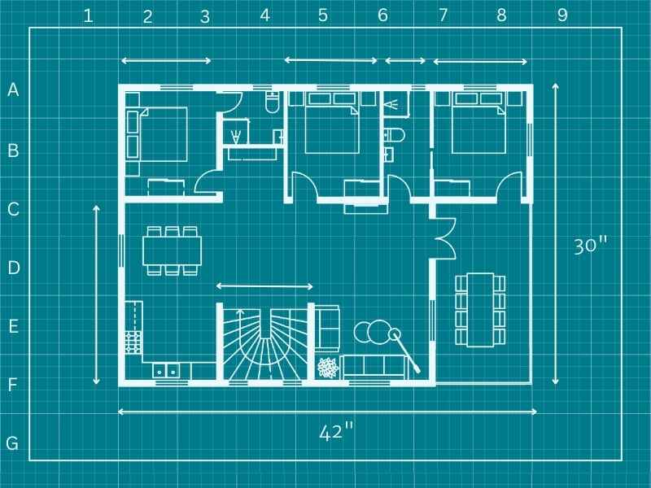
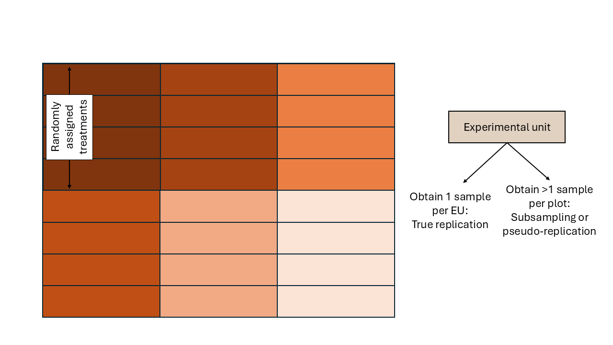

# Basic types of designed experiments   
June 10th, 2025  

## Announcements

- Not sure about your project topic? Schedule a meeting!

## Review  
- Differences between observational data and data generated by controlled experiments.  
- The role of experiment design in causal inference. 
- The golden rules of designed experiments:
  - Randomization
  - Replication
  - Local control (blocking)

- Experimental unit: smallest unit to which a treatment is independently assigned/applied. 
- Observational unit: smallest unit on which observations are made. 

## Types of designs - the basics  

There are several ways to carry out an experiment. 
The way we carry out an experiment is important because it will establish the blueprint for how the data are generated. 
This means that the design will determine **what observations are similar to each other**. 

```{r blueprint, echo=FALSE, fig.cap="A blueprint is to a building what the experimental design is to the data. [Source](https://www.roomsketcher.com/blog/how-to-draw-a-blueprint/)", out.width = '70%'}

```

### Completely randomized design (CRD)  

- *Blueprint*: all experimental units are similar. 
The only factor driving differences between observations is the treatment (and randomness).  

\begin{equation}
  y_{ij} = \mu + \tau_i + \varepsilon_{ij},
\end{equation}
\begin{equation}
  \varepsilon_{ij} \sim N(0, \sigma^2),
\end{equation}
where $y_{ij}$ is the $j$th observation of the $i$th treatment, $\mu$ is the overall mean, $\tau_i$ is the effect of the $i$th treatment, and $\varepsilon_{ij}$ is the residual for the $j$th observation of the $i$th treatment (i.e., the difference between observed and predicted).  


```{r crd, echo=FALSE, fig.cap="Schematic description of an experiment with a completely randomized design", out.width = '100%'}
knitr::include_graphics("../figures/designs_crd.PNG")
```

### Randomized complete block design (RCBD)   

- Blocks are groups of similar experimental units and are large enough to fit each treatment at least once  
- *Blueprint*: all experimental from the same block are similar to each other. 
The factors driving differences between observations are the treatment and the blocks (and randomness).  

\begin{equation}
  y_{ijk} = \mu + \tau_i + \rho_j + \varepsilon_{ijk},
\end{equation}
\begin{equation}
  \varepsilon_{ijk} \sim N(0, \sigma^2),
\end{equation}
where $y_{ij}$ is the $j$th observation of the $i$th treatment, $\mu$ is the overall mean, $\tau_i$ is the effect of the $i$th treatment, $\rho_j$ is the effect of the $j$th block, and $\varepsilon_{ij}$ is the residual for the $j$th observation of the $i$th treatment (i.e., the difference between observed and predicted).  


```{r rcbd, echo=FALSE, fig.cap="Schematic description of an experiment with a randomized complete block design", out.width = '100%'}
knitr::include_graphics("../figures/designs_rcbd.PNG")
```

### Incomplete block design (IBD)   

- Blocks are groups of similar experimental units and are not large enough to fit each treatment at least once   
- *Blueprint*: all experimental from the same block are similar to each other. 
The factors driving differences between observations are the treatment and the blocks (and randomness).  
- We will define the model for this design later on, after learning more about mixed models.

```{r ibd, echo=FALSE, fig.cap="Schematic description of an experiment with an incomplete block design", out.width = '100%'}

```

## Skeleton ANOVA tables    

The Analysis of Variance (ANOVA) can be considered a special case of a linear model that divides the predictors in bins to evaluate their influence on the response ([Gelman 2005](https://projecteuclid.org/journals/annals-of-statistics/volume-33/issue-1/Analysis-of-variancewhy-it-is-more-important-than-ever/10.1214/009053604000001048.full)).

- Write the topographical sources of variation  
- Write the treatment sources of variation  
- Degrees of freedom
  - An intuitive approach to degrees of freedom: number of independent values. Whiteboard demo. 
- Combine the combined skeleton ANOVA. 

### Practice examples  

- **Plant breeding**. A field has 4 homogeneous regions and is divided into 18 smaller plots. Withing those regions, the researchers have randomly assigned the 18 genotypes being tested in the study. 

- **Swine nutrition**. A swine facility has 3 rooms containing 12 pens (i.e. 36 total pens), each with 4 pigs (note: pigs are similar across pens in a room). Within each room, 6 feeding treatments are randomly allocated to each pen (i.e. each treatment is repeated twice in each room). 

```{r}
data.frame(`Source of variation` = c("Blocks", "Treatment", "Error", "Total"),
           df = c("b-1 = 3-1 = 2", "t-1 = 6-1 = 5", "(u-1)*b - (t-1) = (12-1)3 - (5-1) = 28", "N-1 = 36 - 1 = 35")) %>%
  knitr::kable(caption = "ANOVA table for the swine example, where b is the number of blocks, t is the number of treatments, u is the number of experimental units per block, and N is the total number of observations.")
```


## Homeworks  

- Start reading: 
  - Chapter 4 in Messy Data Vol1 (Milliken & Johnson) OR   
  - Chapter 2 in GLMM (Stroup, 1st ed) - 1st edition of the GLMM book, until "Complication"   
- Schedule a meeting to discuss your project topic. 
