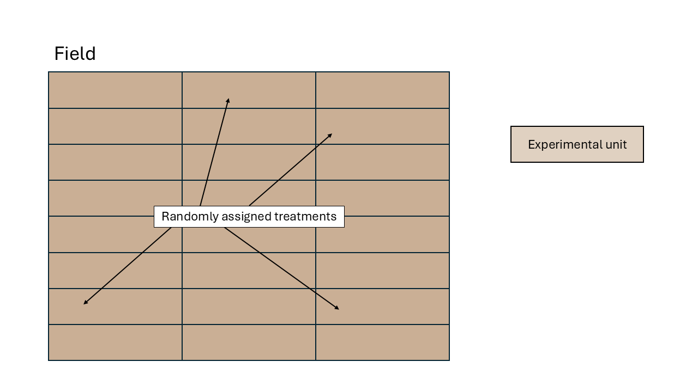

# Basic types of designed experiments   
June 10th, 2025  

- Differences between observational data and data generated by controlled experiments.  
- The role of experiment design in causal inference. 
- The golden rules of designed experiments:
  - Randomization
  - Replication
  - Local control (blocking)

- Experimental unit: smallest unit to which a treatment is independently assigned/applied. 
- Observational unit: smallest unit on which observations are made. 

## Types of designs - the basics  

There are several ways to carry out an experiment. 
The way we carry out an experiment is important because it will establish the blueprint for how the data are generated. 
This means that the design will determine **what observations are similar to each other**. 

```{r blueprint, echo=FALSE, fig.cap="A blueprint is to a building what the experimental design is to the data. [Source](https://www.roomsketcher.com/blog/how-to-draw-a-blueprint/)", out.width = '70%'}
knitr::include_graphics("../figures/blueprint.jpg")
```

### Completely randomized design (CRD)  

- *Blueprint*: all experimental units are similar. 
The only factor driving differences between observations is the treatment (and randomness).  

\begin{equation}
  y_{ij} = \mu + \tau_i + \varepsilon_{ij},
\end{equation}
\begin{equation}
  \varepsilon_{ij} \sim N(0, \sigma^2),
\end{equation}
where $y_{ij}$ is the $j$th observation of the $i$th treatment, $\mu$ is the overall mean, $\tau_i$ is the effect of the $i$th treatment, and $\varepsilon_{ij}$ is the residual for the $j$th observation of the $i$th treatment (i.e., the difference between observed and predicted).  


```{r crd, echo=FALSE, fig.cap="Schematic description of an experiment with a completely randomized design", out.width = '100%'}

```

### Randomized complete block design (RCBD)   

- Blocks are groups of similar experimental units and are large enough to fit each treatment at least once  
- *Blueprint*: all experimental from the same block are similar to each other. 
The factors driving differences between observations are the treatment and the blocks (and randomness).  

\begin{equation}
  y_{ij} = \mu + \tau_i + \rho_j + \varepsilon_{ij},
\end{equation}
\begin{equation}
  \varepsilon_{ij} \sim N(0, \sigma^2),
\end{equation}
where $y_{ij}$ is the $j$th observation of the $i$th treatment, $\mu$ is the overall mean, $\tau_i$ is the effect of the $i$th treatment, $\rho_j$ is the effect of the $j$th block, and $\varepsilon_{ij}$ is the residual for the $j$th observation of the $i$th treatment (i.e., the difference between observed and predicted).  


```{r rcbd, echo=FALSE, fig.cap="Schematic description of an experiment with a randomized complete block design", out.width = '100%'}
knitr::include_graphics("../figures/designs_rcbd.PNG")
```

### Incomplete block design (IBD)   

- Blocks are groups of similar experimental units and are not large enough to fit each treatment at least once   
- *Blueprint*: all experimental from the same block are similar to each other. 
The factors driving differences between observations are the treatment and the blocks (and randomness).  
- We will define the model for this design later on.

```{r ibd, echo=FALSE, fig.cap="Schematic description of an experiment with an incomplete block design", out.width = '100%'}
knitr::include_graphics("../figures/designs_ibd.PNG")
```

