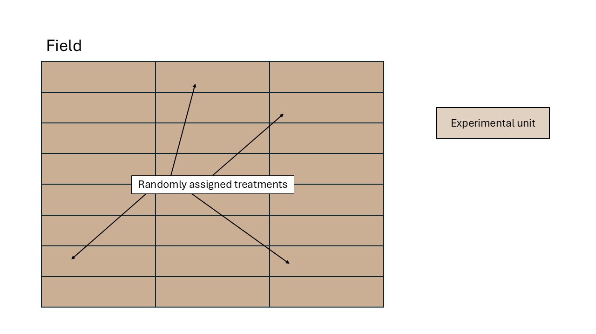

# Basic types of designed experiments   
June 11th, 2025  

## Review  

- Experimental unit  
- The golden rules of designed experiments:
  - Replication
  - Randomization
  - Local control (blocking)

## Types of designs  

### Completely randomized design (CRD)  

```{r echo=FALSE, fig.cap="Schematic description of an experiment with a completely randomized design", out.width = '100%'}

```

### Randomized complete block design (RCBD)   

- Blocks are groups of similar experimental units and are large enough to fit each treatment at least once  

```{r echo=FALSE, fig.cap="Schematic description of an experiment with a randomized complete block design", out.width = '100%'}
knitr::include_graphics("../figures/designs_rcbd.PNG")
```

## Building an ANOVA skeleton using design (aka topographical) and treatment elements  

```{r echo=FALSE, message=FALSE, warning=FALSE}
t_topo <- data.frame(Source = c("Block", " ", "Pens(Block)", "Total"),
                     df = c("b-1", "-", "(u-1)*b", "N-1"))
t_trt <- data.frame(Source = c(" ", "Treatment", "Parallels", "Total"),
                    df = c("-", "t-1", "N-t", "N-1"))
t_comb <- data.frame(Source = c("Block", "Treatment", "Pens(Block x Trt)", "Total"),
                    df = c("b-1", "t-1", "(u-1)*b - (t-1)", "N-1"))

knitr::kables(
  list(
    knitr::kable(t_topo, caption = "Experiment or Topographical"),
    knitr::kable(t_trt, caption = "Treatment"),
    knitr::kable(t_comb, caption = "Combined Table")
  ),
  caption = 'Constructing the ANOVA skeleton'
)
```

This way to do an ANOVA is normally considered the "What Would Fisher Do" ANOVA. Sir R.A. Fisher did plenty of his very influential work while he was working at the Rothamsted Agricultural Station! 

<center>
{width=90%}
</center>

## Linear model good old friend  

- What does "linear" mean?  
- What does "ANOVA" mean?  

\begin{equation}
  y_{ij} = \mu + \tau_i + \varepsilon_{ij}, \\ \varepsilon_{ij} \sim N(0, \sigma^2),
\end{equation}

OR 

\begin{equation}
  y_{i} = \beta_0 + x_{1i}\beta_1 +x_{2i}\beta_2 + x_{3i}\beta_3 + \varepsilon_{i}, \\
  \varepsilon_{i} \sim N(0, \sigma^2), \\
  x_{1i} = \begin{cases}
      1, & \text{if treatment A}\\
			0, & \text{otherwise}
		 \end{cases} \\
  x_{2i} = \begin{cases}
      1, & \text{if treatment B}\\
			0, & \text{otherwise}
		 \end{cases} \\
  x_{3i} = \begin{cases}
      1, & \text{if treatment C}\\
			0, & \text{otherwise}
		 \end{cases}
\end{equation}

OR 

\begin{equation}
  \mathbf{y} = \mathbf{X}\boldsymbol{\beta} + \boldsymbol{\varepsilon}, \\
  \boldsymbol{\varepsilon} \sim N(\boldsymbol{0}, \sigma^2 \mathbf{I}), \\
\end{equation}

OR 

\begin{equation}
  \mathbf{y} \sim N(\boldsymbol{\mu}, \sigma^2 \mathbf{I}), \\
  \boldsymbol{\mu} = \mathbf{X}\boldsymbol{\beta} + \boldsymbol{\varepsilon}
\end{equation}


### The most common assumptions behind most software  

- Constant variance  
- Independence  
- Normality  

We can describe the general linear model as
\begin{equation}
  y_{ij} = \mu + \tau_i + \varepsilon_{ij},
\end{equation}
\begin{equation}
  \varepsilon_{ij} \sim N(0, \sigma^2),
\end{equation}
where $y_{ij}$ is the $j$th observation of the $i$th treatment, $\mu$ is the overall mean, $\tau_i$ is the treatment effect of the $i$th treatment, and $\varepsilon_{ij}$ is the residual for the $j$th observation of the $i$th treatment (i.e., the difference between observed and predicted).  

The form used to describe the model above is called "Model equation form". 
Another way of saying the same is the "Probability distribution form", where we describe the distribution of $y$ directly.   
\begin{equation}
  y_{ij} \sim N(\mu_{ij}, \sigma^2),
\end{equation}
or
\begin{equation}
  \mathbf{y} \sim N(\mu_{ij}, \sigma^2).
\end{equation}

## Some Practice  

Check out [this R script](../scripts/06112025_rcbd.Rmd) to follow along!  


## To do  

- Start reading: 
  - Chapter 4 in Messy Data Vol1 (Milliken & Johnson) OR   
  - Chapter 2 in GLMM (Stroup, 1st ed) - 1st edition of the GLMM book, until "Complication"   
- Schedule a meeting to discuss your project topic. 

