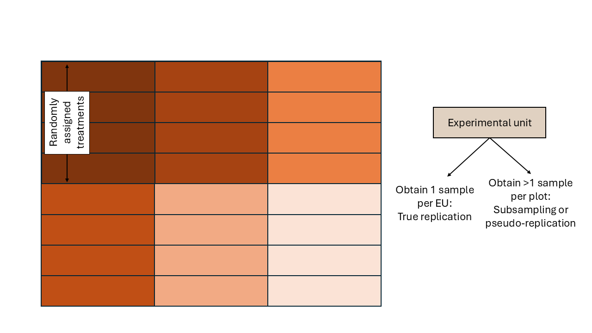

# Basic types of designed experiments   
June 11th, 2025  

## Review  

- Experimental unit  
- The golden rules of designed experiments:
  - Replication
  - Randomization
  - Local control (blocking)

## Types of designs  

### Completely randomized design (CRD)  

```{r echo=FALSE, fig.cap="Schematic description of an experiment with a completely randomized design", out.width = '100%'}
knitr::include_graphics("../figures/designs_crd.PNG")
```

### Randomized complete block design (RCBD)   

- Blocks are groups of similar experimental units and are large enough to fit each treatment at least once  

```{r echo=FALSE, fig.cap="Schematic description of an experiment with a randomized complete block design", out.width = '100%'}
knitr::include_graphics("../figures/designs_rcbd.PNG")
```

### Incomplete block design (IBD)   

- Blocks are groups of similar experimental units and are not large enough to fit each treatment at least once   

```{r echo=FALSE, fig.cap="Schematic description of an experiment with an incomplete block design", out.width = '100%'}

```


## Linear model good old friend  

- What does "linear" mean?  
- What does "ANOVA" mean?  

### The most common assumptions behind most software  

- Constant variance  
- Independence  
- Normality  

We can describe the general linear model as
\begin{equation}
  y_{ij} = \mu + \tau_i + \varepsilon_{ij},
\end{equation}
\begin{equation}
  \varepsilon_{ij} \sim N(0, \sigma^2),
\end{equation}
where $y_{ij}$ is the $j$th observation of the $i$th treatment, $\mu$ is the overall mean, $\tau_i$ is the treatment effect of the $i$th treatment, and $\varepsilon_{ij}$ is the residual for the $j$th observation of the $i$th treatment (i.e., the difference between observed and predicted).  

The form used to describe the model above is called "Model equation form". 
Another way of saying the same is the "Probability distribution form", where we describe the distribution of $y$ directly.   
\begin{equation}
  y_{ij} \sim N(\mu_{ij}, \sigma^2),
\end{equation}
or
\begin{equation}
  \mathbf{y} \sim N(\mu_{ij}, \sigma^2).
\end{equation}


