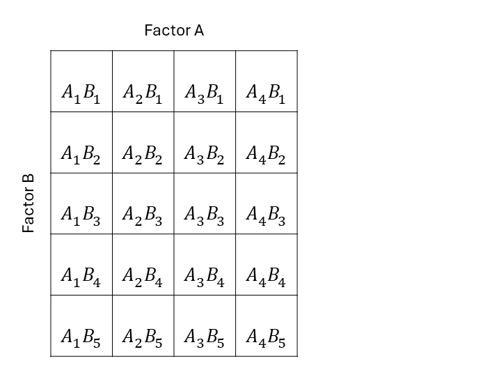

# The treatment structure    
June 16th, 2025  

## Announcements 

- Homework due this Friday  
- Project proposal due this Friday  
- Next week will be on Zoom  

## Review  

- The sources of variability in an experiment:
  - Treatment 
  - Logistics, design, topographical 

## Treatment structure  

The treatment structure in an experiment is directly connected to the research question, i.e. what the researchers want to study. 

### Types of treatment structures

- One-way treatment structure: a set of $t$ treatments or populations where there is no assumed structure among the treatments. 
```{r echo=FALSE, fig.cap="Schematic description of an experiment with a one-way treatment structure", out.width = '100%'}
knitr::include_graphics("../figures/trtdesigns_oneway.PNG")
```

- Two-way treatment structure: a set of treatments constructed by combining the levels or possibilities of two factors. Two-way factorial treatment structure. 
```{r echo=FALSE, fig.cap="Schematic description of an experiment with a two-way treatment structure", out.width = '100%'}

```

- Factorial arrangement treatment structure: a set of treatments constructed by combining the levels or possibilities of two or more different factors. 

```{r echo=FALSE, fig.cap="Schematic description of an experiment with a three-way treatment structure", out.width = '100%'}
knitr::include_graphics("../figures/trtdesigns_threeway.PNG")
```

- Fractional factorial arrangement treatment structure: only a part, or fraction, of the possible treatment combinations in a factorial arrangement treatment structure.

```{r echo=FALSE, fig.cap="Schematic description of an experiment with a two-way fractional treatment structure", out.width = '100%'}
knitr::include_graphics("../figures/trtdesigns_twowayfract.PNG")
```

- Factorial arrangement treatment structure with one or more controls. 

```{r echo=FALSE, fig.cap="Schematic description of an experiment with a two-way treatment structure with two controls", out.width = '100%'}
knitr::include_graphics("../figures/trtdesigns_twoway_control.PNG")
```

- Examples on the whiteboard  

## Where is the treatment structure connected to the statistical model?

Remember: the general advice is to divide the sources of variation into treatment and design (i.e., topographical). 
Normally, the treatments affect the expected value and the experiment design has created groups of data that were generated together. 
Those groups are groups of *similar* data and that's why we say that they are correlated. 
For now, we'll leave said correlation in the residual variance-covariance matrix $\mathbf{R}$. 

- One-way treatment structure  

$$\mathbf{y} \sim N(\boldsymbol{\mu}, \mathbf{R}), \\ \mu_{j} = \mu + \tau_j $$

- Two-way treatment structure  

$$\mathbf{y} \sim N(\boldsymbol{\mu}, \mathbf{R}), \\ \mu_{jk} = \mu + \tau_j + \rho_k +(\tau \rho)_{jk}$$

- Factorial treatment structure 

$$\mathbf{y} \sim N(\boldsymbol{\mu}, \mathbf{R}), \\ \mu_{jkl} = \mu + \tau_j + \rho_k + \gamma_l +(\tau \rho)_{jk}+(\tau \gamma)_{jl} + ( \rho \gamma)_{kl} + (\tau \rho \gamma)_{jkl}$$ 

- Fractional factorial treatment structure, factorial treatment structure with controls 
  Some version of: 
  
$$\mathbf{y} \sim N(\boldsymbol{\mu}, \mathbf{R}), \\ \mu_{jk} = \mu + \tau_j + \rho_k +(\tau \rho)_{jk}$$

## Tomorrow:  

- All this is in Chapter 4 in Milliken and Johnson. 

