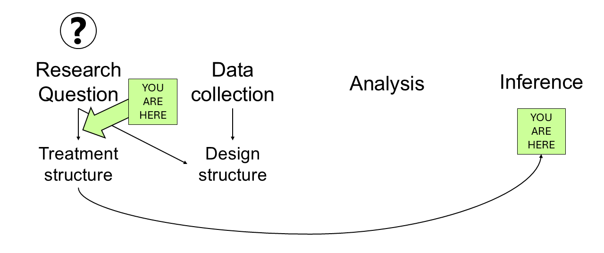

# What you ask of a designed experiment    
June 17th, 2025  

## Announcements 

- Homework due this Friday  
- Project proposal due this Friday  
- Next week will be on Zoom  

## Review  

Pre-selected treatments are usually assumed to affect the expected value. 
Today we'll focus on those means of interest.  

```{r echo=FALSE, fig.cap="Mindmap of the analysis of a designed experiment, from the inception to the end conclusions", out.width = '100%'}

```

## ANOVA   

```{r echo=FALSE, message=FALSE, warning=FALSE}
t_trt <- data.frame(Source = c("Treatment", "Parallels", "Total"),
                    df = c("t-1", "N-t", "N-1"))
knitr::kable(t_trt, caption = "Treatment ANOVA for a one-way treatment structure")
```


```{r echo=FALSE, message=FALSE, warning=FALSE}
t_trt <- data.frame(Source = c("Factor A", "Factor B", "A x B", "Parallels", "Total"),
                    df = c("a-1", "b-1", "(a-1)(b-1)", "N-(ab)", "N-1"))
knitr::kable(t_trt, caption = "Treatment ANOVA for a two-way treatment structure")
```

```{r echo=FALSE, message=FALSE, warning=FALSE}
t_trt <- data.frame(Source = c("Factor A", "Factor B", "Factor C", "A x B", "A x C",
                               "B x C", "A x B x C",
                               "Parallels", "Total"),
                    df = c("a-1", "b-1", "c-1", "(a-1)(b-1)", "(a-1)(c-1)", 
                           "(b-1)(c-1)", "(a-1)(b-1)(c-1)",
                           "N-(abc)", "N-1"))
knitr::kable(t_trt, caption = "Treatment ANOVA for a three-way factorial treatment structure")
```

### In case you were wondering: ANOVA and types of sums of squares

- Type I SS: ordered 
- Type II SS: conditional on main effects 
- Type III SS: conditional on all effects  
- From SS to test F value, to hypothesis test: 
  - $F = \frac{SS_{t}/df_t}{SS_{e}/df_e}$

## Setting the stage: Estimated marginal means aka least squares means 

Sometimes, model coefficients or effects are hard to interpret. 
In designed experiments, we often use the estimated marginal means or least square means to provide a more interpretable result. 
Estimated marginal means are the expected mean for a given level of a factor, averaging over the other factors in the model. 
In `R`, the estimated marginal means are famously handled with the `emmeans` package. 

### Example:  

Download the [R script](../scripts/06172025_trt.Rmd) to follow along!

More about estimated marginal means: 

- `emmeans` website [[link](https://rvlenth.github.io/emmeans/)]

### Discussion 

- What is the risk of making inference over a single treatment factor when the estimated interaction seemed to be relevant to explain variability in the data? 
- Where do the degrees of freedom come from?  

## Tomorrow  

- More hands-on practice. 
- [Your moment to ask the questions about least square means you've always wanted to ask.](https://docs.google.com/forms/d/e/1FAIpQLScxVkuFFT4aB_LEpI_yl-SYSubvgqWJlN2fYkFHN3SUP8sOnQ/viewform?usp=dialog) 

