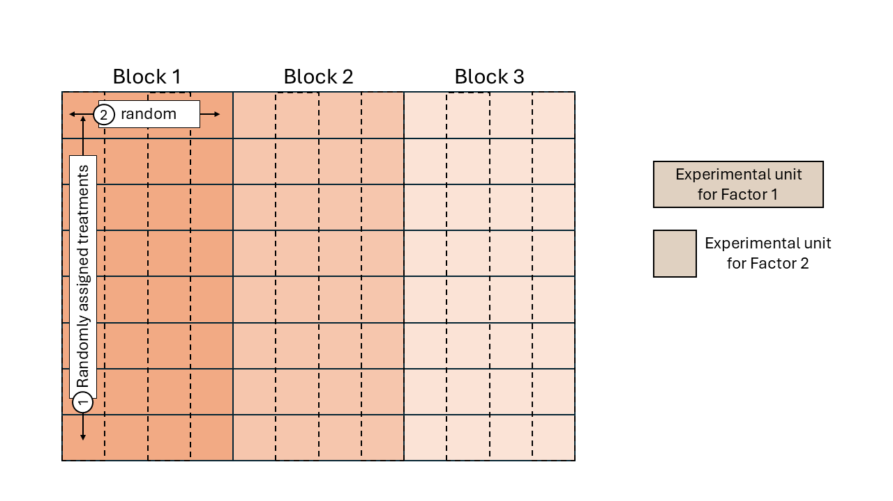
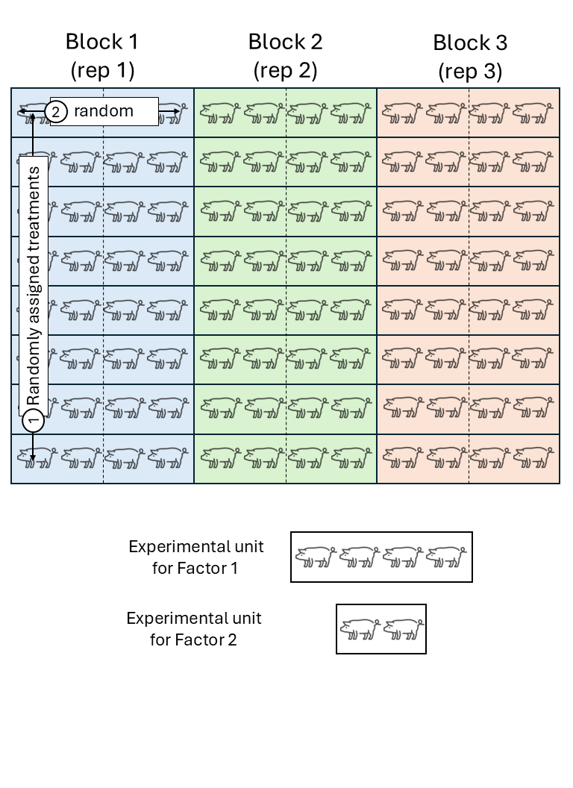

# Practice: Hierarchical (Multilevel) Designs 
June 25th, 2025  

## Review: Hierarchical Designs 

- Remember the definition of experimental unit? The smallest unit to which a treatment is independently applied. 
- Sometimes we find that there are different sizes of experimental units. 
- In such cases, it is important to identify the different experimental units and the randomization scheme. We may be in front of a multilevel design. 

```{r echo=FALSE, fig.cap="Schematic description of a field experiment with a split-plot design", out.width = '100%'}

```

```{r echo=FALSE, fig.cap="Schematic description of a swine experiment with a split-plot design", out.width = '100%'}

```

- Sometimes, these differences in the sizes of EUs are not that easy to notice.  
- More details in Analysis of Messy Data - Ch5. 

### More pictures:  


## R demo 

[Follow along with this R script!](../scripts/06252025_splitplot1.Rmd)

## Tomorrow  

- Zoom classes -- we will use the link for the office hours 

