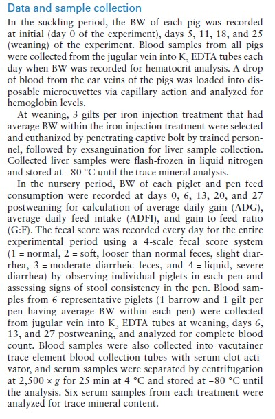
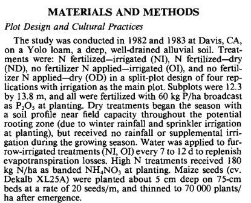
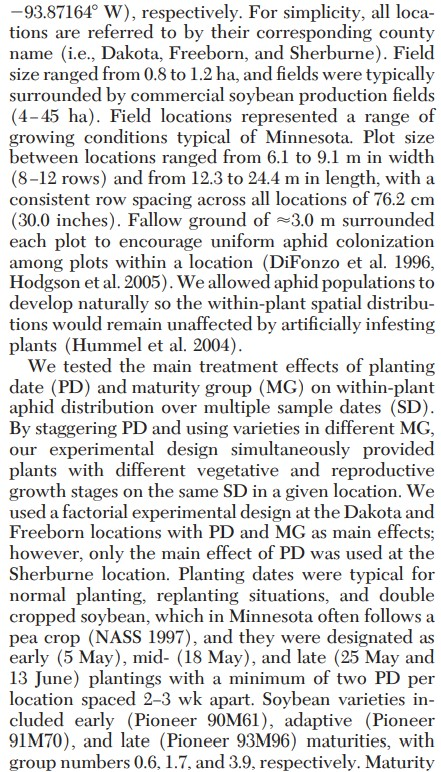

# What goes in the materials and methods sections of papers 
June 27th, 2025  

## What is the purpose of a M&M section?  

- Understanding the study 
- Let someone else replicate your results 
- Peer review 
- Attendance today: fill out [this form](https://forms.gle/9u2VYnCzJQ4zsanF8). 

## Fungicide x barley genotypes review  

Grown in 1995-1996 at the Scottish Crop Research Institute. 4 blocks, 2 fungicide treatments, and 70 barley varieties. Total area was 10 rows (north/south) by 56 beds (east/west). 


```{r echo=F, message=FALSE, warning=FALSE}
library(tidyverse)
library(agridat)
library(ggpubr)

data("durban.splitplot")
df <- durban.splitplot

theme_set(theme_minimal())

p_blocks <- 
  df %>% 
  ggplot(aes(bed, row))+
  geom_tile(aes(fill = block))+
  geom_tile(color = "black", fill=NA)+
  coord_fixed()

p_wholeplot <-
  df %>% 
  ggplot(aes(bed, row))+
  geom_tile(aes(fill = fung))+
  geom_tile(color = "black", fill=NA)+
  coord_fixed()

p_splitplot <- 
df %>% 
  ggplot(aes(bed, row))+
  geom_tile(aes(fill = gen), show.legend= F)+
  geom_tile(color = "black", fill=NA)+
  coord_fixed()

ggarrange(p_blocks, p_wholeplot, p_splitplot, ncol = 1, nrow = 3)
```

## Some examples  

And remember: 

- **Treatment Structure**  
  - Defines the treatment mean 
  - Deterministic part of the model 

- **Design Structure**  
  - Defines the dependence patterns in the data 
  - Stochastic (random) part of the model  
  
Test: can you make a sketch of the data generating process?

```{r message=FALSE, echo=FALSE, warning=FALSE, fig.cap="M&M example 1 - Study objective: To evaluate the effects of second iron injection and dietary iron levels on growth performance, hematological parameters, serum and liver mineral content, fecal score, short-chain fatty acids, and the microbiome of pigs.", out.width = '50%'}

```


```{r message=FALSE, echo=FALSE, warning=FALSE, fig.cap="M&M example 2 - Study objective: To understand of stress effects (e.g., water or nitrogen deficit) on senescence of field-grown plants.", out.width = '50%'}

```


```{r message=FALSE, echo=FALSE, warning=FALSE, fig.cap="M&M example 3 - Study objective: To describe the vertical distribution of soybean aphid within a soybean plant over time and to define optimal sample units of varying sizes", out.width = '50%'}

```


## Monday  

- Kahoot! 

