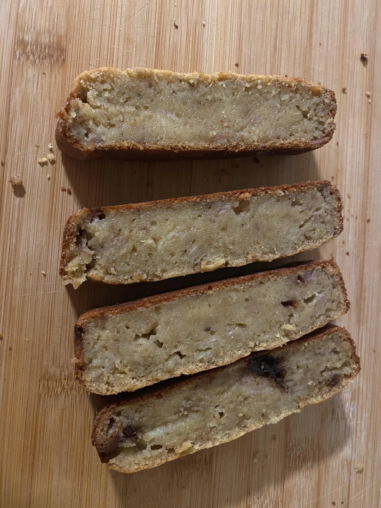

# Review: RCBD and split-plot 
July 1st, 2025  

Today, tomorrow and Wednesday we'll do a hands-on demo on designing an experiment.  

## Background  

Just like banana bread, banana muffins are different to other types of muffins because their dough includes bananas, which sometimes makes it challenging to get a fluffy crumb.  
If you don't manage your oven temperature and amount of bananas properly, you might end up with a dough that is too heavy, does not rise properly, and ends up like the picture below. 
We'll start with our go-to banana recipe and fine-tune the best baking temperature to get fluffy muffins. 
Check out the recipe [here](https://www.ouichefnetwork.com/2016/06/a-life-changing-banana-nut-muffin.html). 

{width=50%}


### Baseline recipe for banana muffins:  

**Dry ingredients:**  

- 1 1/2 cups all-purpose flour (7 1/2 ounces)
- 1 1/2 teaspoons baking powder 
- 1/4 teaspoon baking soda 
- 1/2 teaspoon salt 
- 1/4 teaspoon ground cinnamon 
- 1/4 teaspoon ground nutmeg
- 2/3 cup finely chopped pecans, toasted

**Wet ingredients:**  

- 1/2 cup light brown sugar (3 3/4 ounces)
- 1/4 cup granulated sugar (2 ounces)
- 2 large eggs
- 1 stick unsalted butter, browned and cooled (4 ounces)
- 1 1/2 cups mashed bananas, from very ripe bananas that have been peeled and mashed well with a fork (12 3/4 ounces)
- 2 tablespoons full-fat sour cream
- 1 teaspoon pure vanilla extract 

## Study / Research question

What is the best temperature to bake the muffins? Let's assume that we prefer higher muffins: what temperature will produce higher muffins? 

- 250 °F 
- 400 °F 
- 550 °F 

### Proposed design experiment: RCBD 

Assuming we spread out all the work into multiple days, we can assume cooking day as the block. 
Then, the model to describe variations in the muffin height can be written as 

$$y_{ik} = \mu + b_k + T_i + \varepsilon_{ik},$$
$$b_k \sim N(0, \sigma_b^2), \\ \varepsilon_{ik} \sim N(0, \sigma_{\varepsilon}^2),$$
where $y_{ik}$ is the observed height for the muffin baked under the $i$th treatment on day $k$, $\mu$ is the overall muffin height, $T_i$ is the effect of the $i$th temperature on muffin height, $b_k$ is the day (block) effect, that arises from a normal distribution with variance $\sigma^2_b$, and $\varepsilon_{ik}$ is the residual for the muffin baked under the $i$th treatment on day $k$.   

The final ANOVA table for this RCBD design is:

```{r echo=FALSE, message=FALSE, warning=FALSE}
t_rcbd <- data.frame(Source = c("Day", "Temperature", "Error(oven)", "Total"),
                    df = c("b-1 = 3-1 = 2", "t-1 = 3-1 = 2", "(t-1)b - (t-1) = 2*3 - 2 = 4", "N-1 = 8"))
knitr::kable(t_rcbd, caption = "Treatment ANOVA for a one-way treatment structure in an RCBD")
```

### Treatment means and confidence intervals  

The treatment mean for the $i$th temperature is $\mu_i = \mu + T_i$. That mean won't change under different design structures. 
What *might* change is the confidence interval around that mean.
[For more information, see Chapter 24 in Milliken and Johnson's *Analysis of Messy Data*].

- First, recall the formula for a CI: $\theta \pm t_{df, \frac{\alpha}{2}} \cdot se(\hat{\theta})$

```{r}
#get test t
qt(p = .975, df = 4) # df are df error(oven)
```

```{r echo=TRUE, eval=FALSE}
# standard error
sqrt((2*sigma(m)^2) / 3)
```

- For example, the CI for the differences between means at 400F - 300F $\mu_{400} - \mu_{300}$ is $(\widehat{\mu_{400} - \mu_{300}}) \pm 2.78 \cdot se(\widehat{\mu_{400} - \mu_{300}})$
- $se(\widehat{\mu_{400} - \mu_{300}}) = \sqrt{\frac{2 \sigma^2_{\varepsilon}}{r}}$

$$\mu_i \pm 2.78 \cdot \sqrt{\frac{2 \sigma^2_{\varepsilon}}{r}}$$


## Tomorrow: 

- What if we want to include more bananas in the recipe? 
- Expand this design including a 3x2 treatment structure in a split-plot design.  

