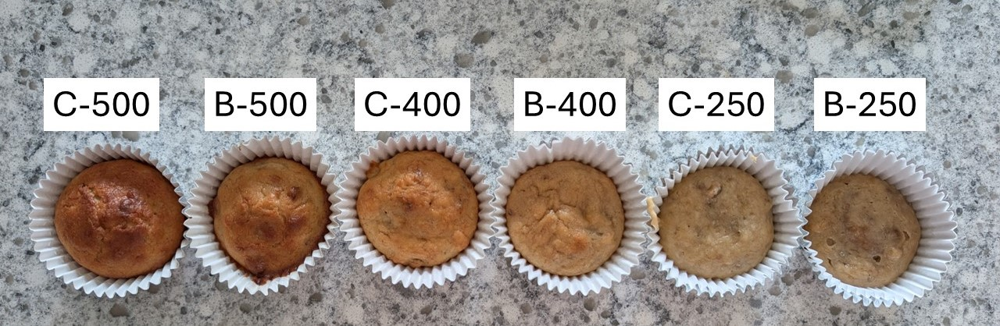
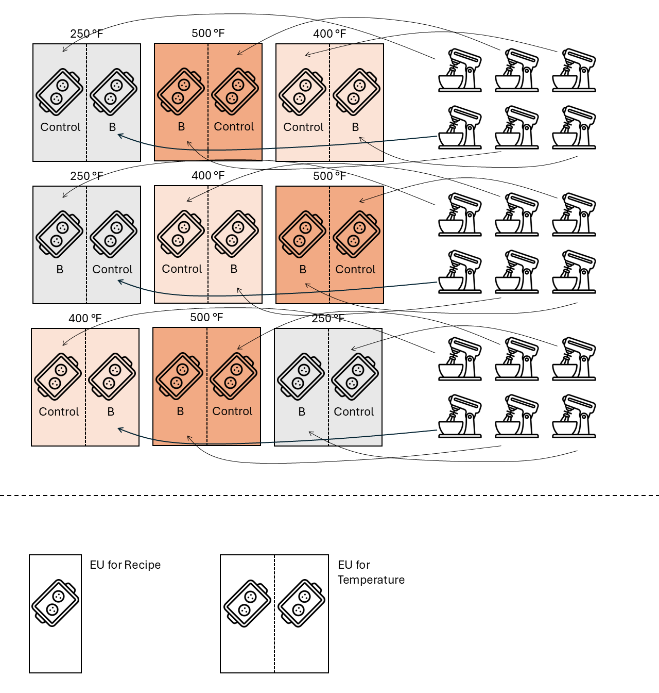
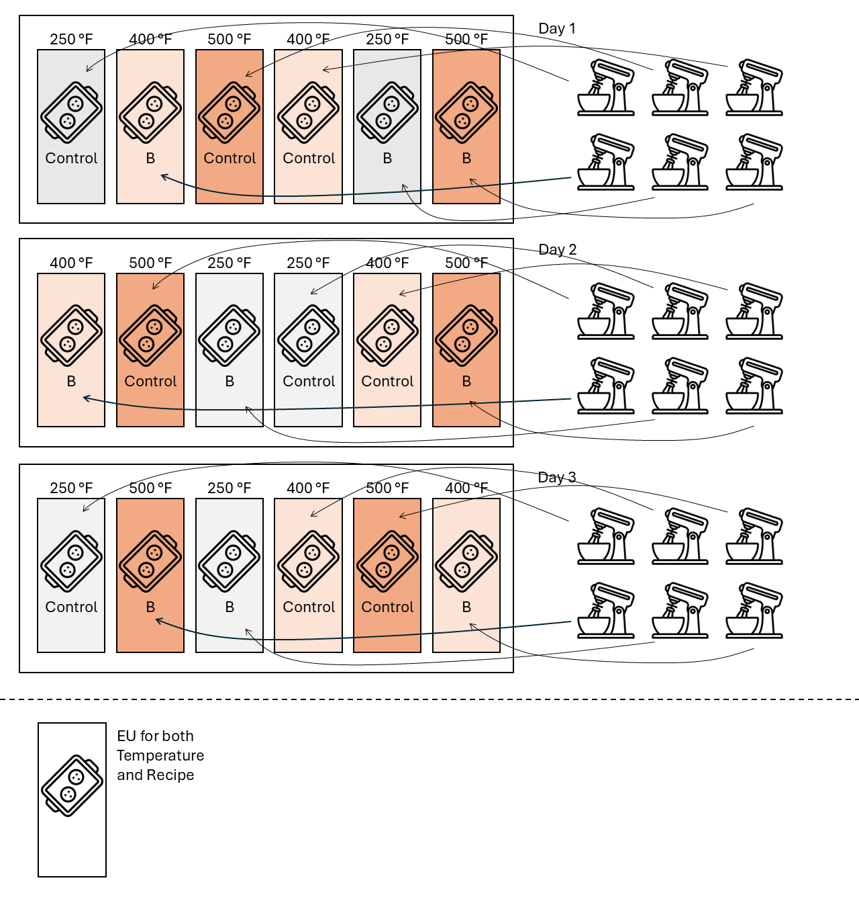

# Analysis and inference for a split-plot design  
July 7th, 2025  

## Announcements

- Homework 3 is due this Friday (July 11). 
- Homework 2 grades will be posted this evening. 
- Semester project: 
  - [An example](https://stat720.github.io/summer2025/assignments/report_example_muffins.pdf) is posted. 
  - Wednesday July 23: send project for peer review. 
  - Schedule for somewhere between July 21-August 1 (anywhere between 8am-5pm): 15 min presentation + 15 min Q&A. 
  - Submit final version of your report by August 1. Include ANOVA, stat model, mock R code, discussion of strengths and weaknesses of the experiment design. 

## Review of our experiment  

- Research question: can we include more banana than the original recipe? Will the optimum temperature change depending on that recipe? 
- Treatment structure: 3 $\times$ 2 factorial, with 3 levels for temperature (250, 400, 500) and 2 levels for recipe (Control, Extra Banana) 
- Design structure: split-plot in an CRD, with temperature in the whole plot. 

```{r echo=FALSE, fig.cap="Muffin experiment", out.width = '100%'}

```

With that treatment structure, the statistical model will always begin with $y_{ijk} = \mu + T_i + R_j +(TR)_{ij}$, followed by the random effects. 
The random effects will depend on the design structure. 

## ANOVA tables  

### Split-plot in a CRD  

```{r echo=FALSE, fig.cap="", out.width = '60%'}

```

```{r echo=FALSE, message=FALSE, warning=FALSE}
t_design <- data.frame(Source = c("", "Error(oven)", 
                                  "", "", "Error(oven)", "Total"),
                       df = c("-", "t*r-1 = 9-1 = 8",
                              "-", "-", "(b-1)* t * r = (2-1) * 3 * 3 = 9",
                              "N-1 = 17"))

t_trt <- data.frame(Source = c("Temperature", "", 
                               "Banana", "TxB", "Parallels", "Total"),
                    df = c("t-1 = 3-1 = 2", "-",
                           "b-1 = 2-1 = 1", "(t-1)*(b-1) = 2", 
                           "N-tb = 18 - (3*2) = 12", "N-1 = 17"))

t_rcbd <- data.frame(Source = c("Temperature", "Error(oven)",
                                "Banana", "TxB", "Error(oven x day)", "Total"),
                    df = c("t-1 = 3-1 = 2",
                           "t*r-1  - (t-1)= 8 - 2 = 6",
                           "b-1 = 2-1 = 1", "(t-1)*(b-1) = 2", 
                           "(b-1)* t * r - (b-1) - (t-1)*(b-1) = 9 - 1 -2 = 6",
                           "N-1 = 17"))

knitr::kables(
  list(
    knitr::kable(t_design, caption = "Design or Topographical Sources of Variability"),
    knitr::kable(t_trt, caption = "Treatment Sources of Variability"),
    knitr::kable(t_rcbd, caption = "Combined Table of the Sources of Variability")
  ),
  caption = 'ANOVA without subsampling'
)
```


### Other possible designs  


#### Split-plot in an RCBD

```{r echo=FALSE, message=FALSE, warning=FALSE}
t_design <- data.frame(Source = c("Day (block)", "", "Error(oven)", 
                                  "", "", "Error(oven x day)", "Total"),
                       df = c("r-1 = 3-1 = 2", "-", "(t-1)*r = (3-1)*3 = 6",
                              "-", "-", "(b-1)* t * r = (2-1) * 3 * 3 = 9",
                              "N-1 = 17"))

t_trt <- data.frame(Source = c(" ", "Temperature", "", 
                               "Banana", "TxB", "Parallels", "Total"),
                    df = c("-", "t-1 = 3-1 = 2", "-",
                           "b-1 = 2-1 = 1", "(t-1)*(b-1) = 2", 
                           "N-tb = 18 - (3*2) = 12", "N-1 = 17"))

t_rcbd <- data.frame(Source = c("Day", "Temperature", "Error(oven)",
                                "Banana", "TxB", "Error(oven x day)", "Total"),
                    df = c("r-1 = 3-1 = 2", "t-1 = 3-1 = 2",
                           "(t-1)*r - (t-1)= 6 -2 = 4",
                           "b-1 = 2-1 = 1", "(t-1)*(b-1) = 2", 
                           "(b-1)* t * r - (b-1) - (t-1)*(b-1) = 9 - 1 -2 = 6",
                           "N-1 = 17"))

knitr::kables(
  list(
    knitr::kable(t_design, caption = "Design or Topographical Sources of Variability"),
    knitr::kable(t_trt, caption = "Treatment Sources of Variability"),
    knitr::kable(t_rcbd, caption = "Combined Table of the Sources of Variability")
  ),
  caption = 'ANOVA without subsampling'
)
```


#### RCBD  
```{r echo=FALSE, message=FALSE, warning=FALSE}
t_design <- data.frame(Source = c("Day (block)", "", "Error(oven)", 
                                  "", "", "Error(oven x day)", 
                                  "Error(recipe x oven x day)", "Total"),
                       df = c("r-1 = 3-1 = 2", "-", "(t-1)*r = (3-1)*3 = 6",
                              "-", "-", "(b-1)* t * r = (2-1) * 3 * 3 = 9",
                              "(m-1) * b * t * r = (3-1) * 2 * 3 * 3 = 36",
                              "N-1 = 53"))

t_trt <- data.frame(Source = c(" ", "Temperature", "", 
                               "Banana", "TxB", "", "Parallels", "Total"),
                    df = c("-", "t-1 = 3-1 = 2", "-",
                           "b-1 = 2-1 = 1", "(t-1)*(b-1) = 2",
                           "-",
                           "N-tb = 54 - (3*2) = 48", "N-1 = 17"))

t_rcbd <- data.frame(Source = c("Day", "Temperature", "Error(oven)",
                                "Banana", "TxB", "Error(oven x day)",
                                "Error(recipe x oven x day)",
                                "Total"),
                     df = c("r-1 = 3-1 = 2", 
                            "t-1 = 3-1 = 2", 
                            "(t-1)*r - (t-1)= 6 -2 = 4",
                           "b-1 = 2-1 = 1", 
                           "(t-1)*(b-1) = 2", 
                           "(b-1)* t * r - (b-1) - (t-1)*(b-1) = 9 - 1 -2 = 6",
                           "(m-1) * b * t * r  - 0 = 36",
                           "N-1 = 53"))

knitr::kables(
  list(
    knitr::kable(t_design, caption = "Design or Topographical Sources of Variability"),
    knitr::kable(t_trt, caption = "Treatment Sources of Variability"),
    knitr::kable(t_rcbd, caption = "Combined Table of the Sources of Variability")
  ),
  caption = 'ANOVA with subsampling'
)
```


```{r echo=FALSE, fig.cap="", out.width = '60%'}

```

## Applied analysis in R

Get code from Thursday [here](../scripts/07032025_muffin_analysis.Rmd). 

