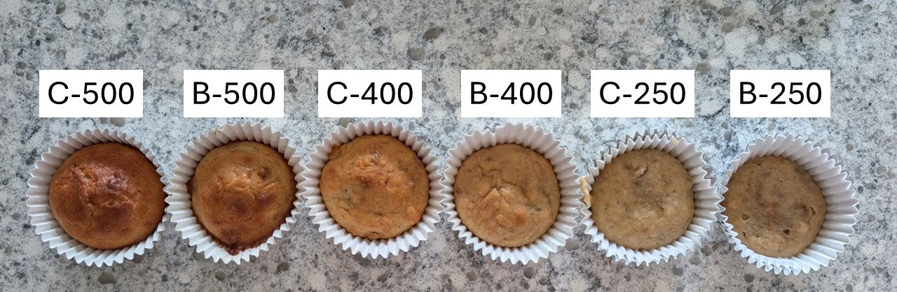

# Analysis and inference for a split-plot design - Part II  
July 8th, 2025  

## Announcements

- Homework 3 is due this Friday (July 11). 
- Homework 4 is posted and due next Friday (July 18). 
- Semester project: 
  - [An example](https://stat720.github.io/summer2025/assignments/report_example_muffins.pdf) is posted. 
  - Wednesday July 23: send project for peer review. 
  - Schedule for somewhere between July 21-August 1 (anywhere between 8am-5pm): 15 min presentation + 15 min Q&A. 
  - Submit final version of your report by August 1. Include ANOVA, stat model, mock R code, discussion of strengths and weaknesses of the experiment design. 

## Review of our experiment  

- Research question: can we include more banana than the original recipe? Will the optimum temperature change depending on that recipe? 
- Treatment structure: 3 $\times$ 2 factorial, with 3 levels for temperature (250, 400, 500) and 2 levels for recipe (Control, Extra Banana) 
- Design structure: split-plot in an CRD, with temperature in the whole plot. 

```{r echo=FALSE, fig.cap="Muffin experiment", out.width = '100%'}

```

With that treatment structure, the statistical model will always begin with $y_{ijk} = \mu + T_i + R_j +(TR)_{ij}$, followed by the effects coming from the design structure (random effects). 

## ANOVA tables  

### Split-plot in a CRD  

```{r echo=FALSE, fig.cap="", out.width = '60%'}
knitr::include_graphics("../figures/muffin_splitplot1.PNG")
```

```{r echo=FALSE, message=FALSE, warning=FALSE}
t_design <- data.frame(Source = c("", "Error(oven)", 
                                  "", "", "Error(recipe x oven), or recipe(oven)", "Total"),
                       df = c("-", "t*r-1 = 9-1 = 8",
                              "-", "-", "(b-1)* t * r = (2-1) * 3 * 3 = 9",
                              "N-1 = 17"))

t_trt <- data.frame(Source = c("Temperature", "", 
                               "Banana", "TxB", "Parallels", "Total"),
                    df = c("t-1 = 3-1 = 2", "-",
                           "b-1 = 2-1 = 1", "(t-1)*(b-1) = 2", 
                           "N-tb = 18 - (3*2) = 12", "N-1 = 17"))

t_rcbd <- data.frame(Source = c("Temperature", "Error(oven)",
                                "Banana", "TxB", "Error(recipe x oven), or recipe(oven)", "Total"),
                    df = c("t-1 = 3-1 = 2",
                           "t*r-1  - (t-1)= 8 - 2 = 6",
                           "b-1 = 2-1 = 1", "(t-1)*(b-1) = 2", 
                           "(b-1)* t * r - (b-1) - (t-1)*(b-1) = 9 - 1 -2 = 6",
                           "N-1 = 17"))

knitr::kables(
  list(
    knitr::kable(t_design, caption = "Design or Topographical Sources of Variability"),
    knitr::kable(t_trt, caption = "Treatment Sources of Variability"),
    knitr::kable(t_rcbd, caption = "Combined Table of the Sources of Variability")
  ),
  caption = 'ANOVA without subsampling'
)
```

#### Implications on inference 

The treatment mean for the $i$th temperature and $j$th banana level is $\mu_{ij} = \mu + T_i + B_j +(TB)_{ij}$ and won't change under different design structures. 
What may change is the confidence interval around the mean difference.  

**Recall the formula for a CI:** $\theta \pm t_{df, \frac{\alpha}{2}} \cdot se(\hat{\theta})$. 

```{r}
#get test t
qt(p = .975, df = 6) # df are df error(oven)
```

- For example, the CI for the differences between means for 250F and 400F $\mu_{1 \cdot} - \mu_{2 \cdot}$ is $(\mu_{1 \cdot} - \mu_{2 \cdot}) \pm 2.45 \cdot se(\widehat{\mu_{1 \cdot} - \mu_{2 \cdot}})$ 
- $se(\widehat{\mu_{1 \cdot} - \mu_{2 \cdot}}) = \sqrt{\frac{2 (\sigma^2_{\varepsilon} + b  \cdot \sigma^2_w)}{b \cdot r}}$

$$\mu_i \pm 2.45 \cdot \sqrt{\frac{2 (\sigma^2_{\varepsilon} + b \cdot \sigma^2_w)}{b \cdot r}}$$


```{r}
#get test t
qt(p = .975, df = 6) # df are df error(recipe x oven), or recipe(oven)
```

- The CI for the differences between means for normal and high banana $\mu_{\cdot 1} - \mu_{\cdot 2}$ is $(\mu_{\cdot 1} - \mu_{\cdot 2}) \pm 2.45 \cdot se(\widehat{\mu_{\cdot 1} - \mu_{\cdot 2}})$ 
- $se(\widehat{\mu_{\cdot 1} - \mu_{\cdot 2}}) = \sqrt{\frac{2 \sigma^2_{\varepsilon}}{t \cdot r}}$

$$\mu_i \pm 2.45 \cdot \sqrt{\frac{2 \sigma^2_{\varepsilon}}{r t}}$$

```{r warning=FALSE, message=FALSE}
# libraries
library(tidyverse)
library(lme4)
library(emmeans)

# data
url <- "https://raw.githubusercontent.com/stat720/summer2025/refs/heads/main/data/muffin_data.csv"
muffins <- read.csv(url)
muffins$oven_temp <- as.factor(muffins$oven_temp)
muffins$rep <- as.factor(muffins$rep)
muffins1 <- muffins %>% filter(subsample == 1)

# fit model
model_subsampling <- 
  lmer(height_cm ~ oven_temp*recipe + (1|rep), 
       data = muffins1)

# get variance components
sigma2 <- sigma(model_subsampling)^2
sigma2_r <- 0.1683^2

r <- 3 # nr of repetitions
t <- 3 # nr of levels for temp 
b <- 2 # nr of levels for banana recipe

# see contrast df and SE
emmeans(model_subsampling, ~oven_temp,
        contr = list(c(1, -1, 0)) )
# this should match the SE above
sqrt(2*(sigma2 + b*sigma2_r)/(r*b))


# see contrast df and SE
emmeans(model_subsampling, ~recipe,
        contr = list(c(1, -1)) )
# this should match the SE above
sqrt(2*sigma2/(r*t))
```


### Same design as above, with subsampling  

```{r echo=FALSE, message=FALSE, warning=FALSE}
t_design <- data.frame(Source = c("", "Error(oven)", 
                                  "", "", "Error(recipe x oven), or recipe(oven)", 
                                  "Error(muffin x recipe x oven), or muffin(recipe x oven)", "Total"),
                       df = c("-", "t*r-1 = 9-1 = 8",
                              "-", "-", "(b-1)* t * r = (2-1) * 3 * 3 = 9",
                              "(s-1)* b * t * r = (3-1) * 2 * 3 * 3 = 36",
                              "N-1 = 53"))

t_trt <- data.frame(Source = c("Temperature", "", 
                               "Banana", "TxB", "Parallels", "Total"),
                    df = c("t-1 = 3-1 = 2", "-",
                           "b-1 = 2-1 = 1", "(t-1)*(b-1) = 2", 
                           "N-tb = 54 - (3*2) = 48", "N-1 = 53"))

t_rcbd <- data.frame(Source = c("Temperature", "Error(oven)",
                                "Banana", "TxB", "Error(recipe x oven), or recipe(oven)", 
                                "Error(muffin x recipe x oven), or muffin(recipe x oven)",
                                "Total"),
                    df = c("t-1 = 3-1 = 2",
                           "t*r-1  - (t-1)= 8 - 2 = 6",
                           "b-1 = 2-1 = 1", "(t-1)*(b-1) = 2", 
                           "(b-1)* t * r - (b-1) - (t-1)*(b-1) = 9 - 1 -2 = 6",
                           "(s-1)* b * t * r = 36", 
                           "N-1 = 53"))

knitr::kables(
  list(
    knitr::kable(t_design, caption = "Design or Topographical Sources of Variability"),
    knitr::kable(t_trt, caption = "Treatment Sources of Variability"),
    knitr::kable(t_rcbd, caption = "Combined Table of the Sources of Variability")
  ),
  caption = 'ANOVA without subsampling'
)
```

## Applied analysis in R  

Get code [here](../scripts/07082025_muffin_analysis_subsampling.Rmd). 

