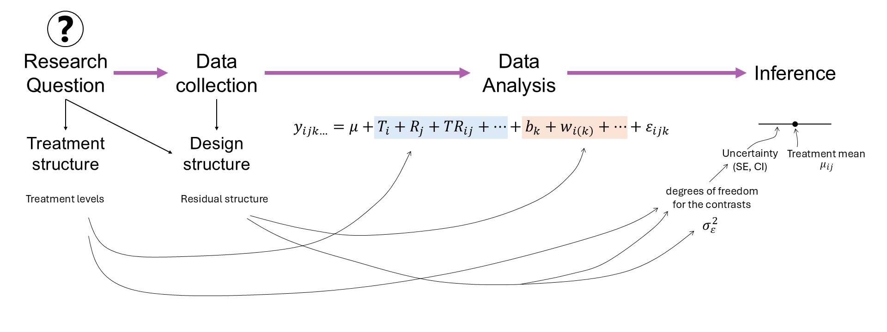
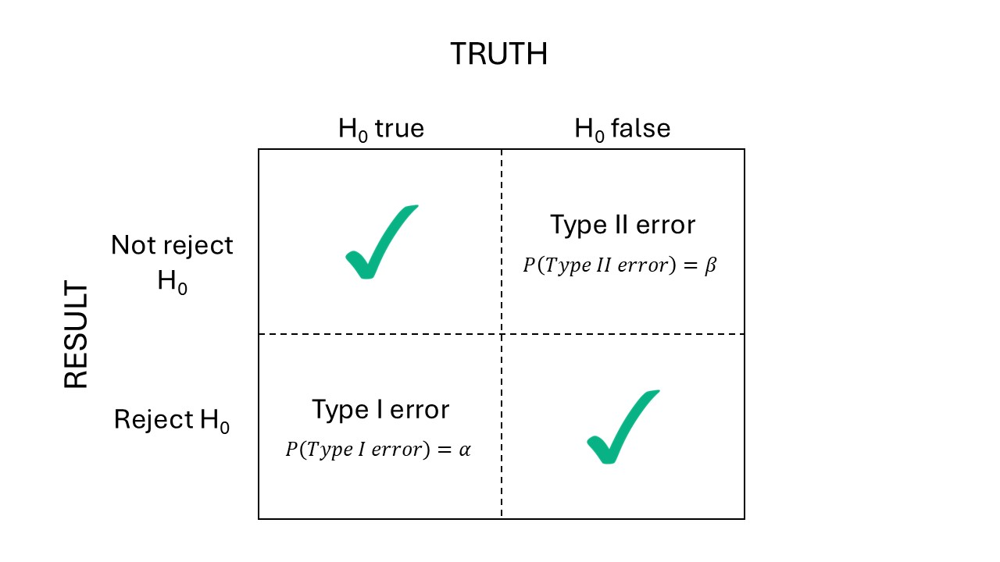

# Power analysis   
July 9th, 2025  

## Announcements

- Today is [Argentina's independence day](https://en.wikipedia.org/wiki/Argentina_Independence_Day)! 

## Review of everything so far  

```{r echo=FALSE, fig.cap="Mindmap", out.width = '100%'}

```


## Power of an experiment  

Let's first review the different types of errors: 

```{r echo=FALSE, fig.cap="Types of error", out.width = '100%'}

```

We normally control $\alpha$, the probability of doing an error of type I. 
TO describe our experiment's ability to detect scientific discoveries, we consider power: the $P(\text{reject } H_0 | H_0 \text{ false}) = 1- \beta$. 
Very often, research teams consider 0.8 power as the minimum for an experiment. 

### Power calculations

**t-test** 

- Used to evaluate differences between treatment effects or means. 
- Example testing against zero: $t^{\star} = \frac{\hat\theta - 0}{s.e.(\hat\theta)} = \frac{\hat\theta - 0}{s.d.(\hat\theta)/\sqrt{n}}$ 
- Note the sensibility to sample size. 
- Also, remember the $s.e.(\hat\theta)$ may differ depending on the design:
  - $s.e.(\hat\theta)$ may depend on $\sigma^2_\varepsilon$ only (e.g., CRD, RCBD, mean comparisons between treatment levels of the treatment at the split-plot level), $s.e.(\hat\theta) = \sqrt{\frac{2 \sigma^2_{\varepsilon}}{r t}}$. 
  - $s.e.(\hat\theta)$ may depend on $\sigma^2_\varepsilon$ and $\sigma^2_{whole \ plot}$ (e.g., mean comparisons between treatment levels of the treatment at the whole-plot level), $s.e.(\hat\theta) = \sqrt{\frac{2 (\sigma^2_{\varepsilon} + b \cdot \sigma^2_w)}{b \cdot r}}$

**To detect a difference** $\delta$: 
$$n = \frac{2\hat{\sigma}^2}{\delta^2}[t_{\alpha/2, \nu} + t_{\beta, \nu}]^2,$$
where: 

- $n$ is the sample size, 
- $\hat\sigma^2$ is the estimate of $\sigma^2$ based on $\nu$ degrees of freedom, 
- $\alpha$ is the type I error rate, 
- $\beta$ is the type II error rate, 
- And note that: $Var(\delta)=2\sigma^2/n$.

## Reminders 

- HW 3 due Friday  
- HW4 is posted 
- Project proposal due dates: July 23, August 1st. 

