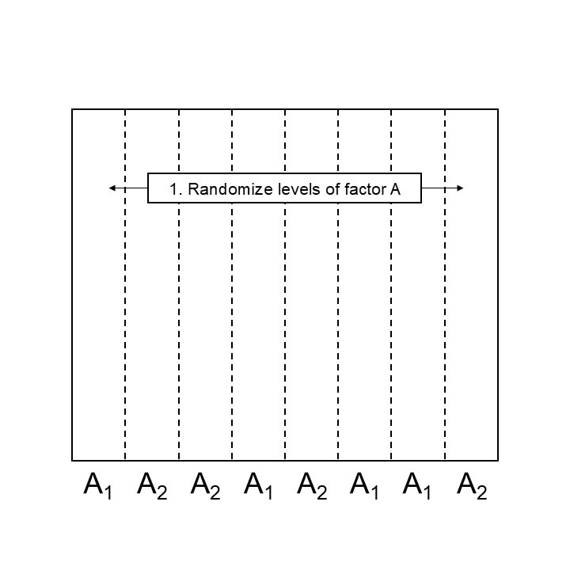

# Split plot designs
July 15th, 2025  

## Announcements

- HW 4 due Friday 

## Split plot designs  

- Split-plot designs are multi-level designed experiments. 
- Randomization happens in different domains. 

Let's look at two alternatives for randomizing the whole-plot factor levels: 

<div style="display: flex;">
  
  
</div>

```{r echo=FALSE, fig.cap="Step 1 designing a split plot design in a CRD", out.width = '60%'}

```

```{r echo=FALSE, fig.cap="Step 1 designing a split plot design in a blocked structure", out.width = '60%'}
knitr::include_graphics("../figures/splitplot_step1_blocks.jpg")
```

```{r echo=FALSE, fig.cap="Step 2 designing a split plot design", out.width = '60%'}
knitr::include_graphics("../figures/splitplot_step2.JPG")
```

**Remember:** 

- Blocks are groups of approximately similar experimental units. 
- Data generated by blocked designs may be analyzed as $y_{ij} = \mu +\tau_i + b_j + \varepsilon_{ij}$, where $y_{ij}$ is the observed response for the $i$th treatment in the $j$th block, $\tau_i$ is the effect of the $i$th treatment, $b_j$ is the effect of the $j$th block, $\varepsilon_{ij}$ is the residual of the $i$th treatment in the $j$th block. 

### Applied case: split-plot design 

Grain yield was measured at for a split-plot experiment of barley with fungicide treatments. 
Within each block, fungicides were randomized and then, barley varieties were randomly applied to smaller plots. 


```{r message=FALSE, warning=FALSE}
library(tidyverse)
library(agridat)
library(lme4)
library(DHARMa)

df_splitplot <- agridat::durban.splitplot

m_splitplot <- lmer(yield ~ fung * gen + (1|block/fung), 
                    data = df_splitplot)

VarCorr(m_splitplot)
```
