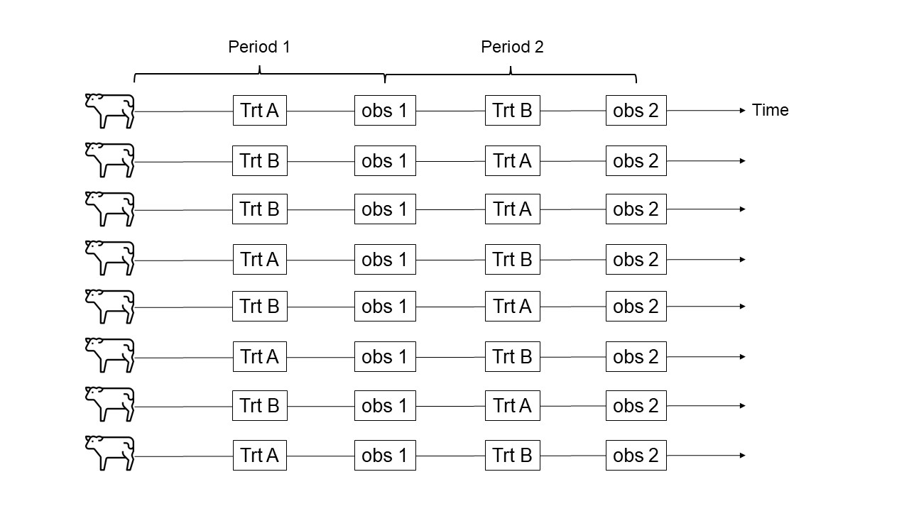

# Crossover Designs II 
July 22nd, 2025  

## Announcements

- Project due on Wednesday to send for peer review. 
- The Difference Between “Significant” and “Not Significant” is not Itself Statistically Significant - [Gelman and Stern (2012)](https://www.tandfonline.com/doi/abs/10.1198/000313006X152649)
- **Homework due tomorrow, 7am:** write a question in this Google Docs, or answer a question someone made. Make sure you have your track changes on, or leave your last name in a comment.  


## Crossover designs  

**Baseline:** 

- Apply treatments to the same experimental unit sequentially, to eliminate between-experimental unit variation when comparing treatments 
- Fewer EUs (probably living beings) are required than in non-crossover designs 
- Power (?) 
- Between-EU variability is accounted for in the model  
- Sources of variability:
  - Treatment ($\geq$2) 
  - Period ($\geq$2) 
  - Sequence ($\geq$2) 
  - Carryover (residual) effects 
  - Between-individuals 
- The EUs are randomized to sequences
- What is the difference between crossover designs capturing between-individuals variability, and subsampling?  


**Overall model:**  

$$y_{ijklm} = \mu + T_i + P_j + S_k +C_{l} + u_m + \varepsilon_{ijklm}, \\
u_{m} \sim N(0, \sigma^2_u), \\
\varepsilon_{ijklm} \sim N(0, \sigma^2_\varepsilon),$$
where:

-  $y_{ijk}$ is the observation for the $i$th treatment, $j$th period with the $m$th previous treatment and the $m$th individual that received the treatments in the $k$th sequence, 
- $T_i$ is the effect of the $i$th treatment, 
- $P_j$ is the effect of the $j$th period, 
- $S_k$ is the effect of the $k$th sequence, 
- $C_{l}$ is the carryover effect of the $l$th treatment,   
- $u_{mk}$ is the (random) effect of the $m$th individual under the $k$th sequence, 
and $\varepsilon_{ijkl}$ is the residual. 

**Considerations:**

**Carryover effects:**

- Experiment designs may be better or worsely designed to separate carryover effect from treatment effect. 
  - Type of treatment, adequate time between treatments ("wash out" period) 
  - Some treatments may damage the individual for indefinite time (e.g., damaging the liver) 

**Repeated measures:**

- When $P > 2$, the several measurements on the same individual assume a compound symmetry correlation function. 
- Other types of correlation functions assume that the correlation "wears out" with time (e.g., AR(1) correlation function) 


```{r echo=FALSE, fig.cap="Schematic representation of a 2x2 crossover design", out.width = '100%'}

```


## Applied example  

6 cows were used to test 3 different treatments in a crossover design.  

- Repeated measures. Now we are assuming compound symmetry (a specific type of correlation function). 
- How does carryover affect power? 


```{r message=FALSE, warning=FALSE}
url <- "https://raw.githubusercontent.com/stat720/summer2025/refs/heads/main/data/cow_prod_cox.csv"
df <- read.csv(url)
df
```


```{r message=FALSE, warning=FALSE}
library(lme4)
library(emmeans)
m_milk.nocarryover <- lmer(milk_production ~ Sequence + Period + Treatment + (1|Sequence:Cow),
               data = df)
emmeans(m_milk.nocarryover, ~ Treatment )

```


```{r}
m_milk.carryover <- lmer(milk_production ~ Sequence + Period + Treatment + Prior_trt + (1|Sequence:Cow),
               data = df)

emmeans(m_milk.carryover, ~ Treatment )
```


## Tomorrow 

- Wrapup
