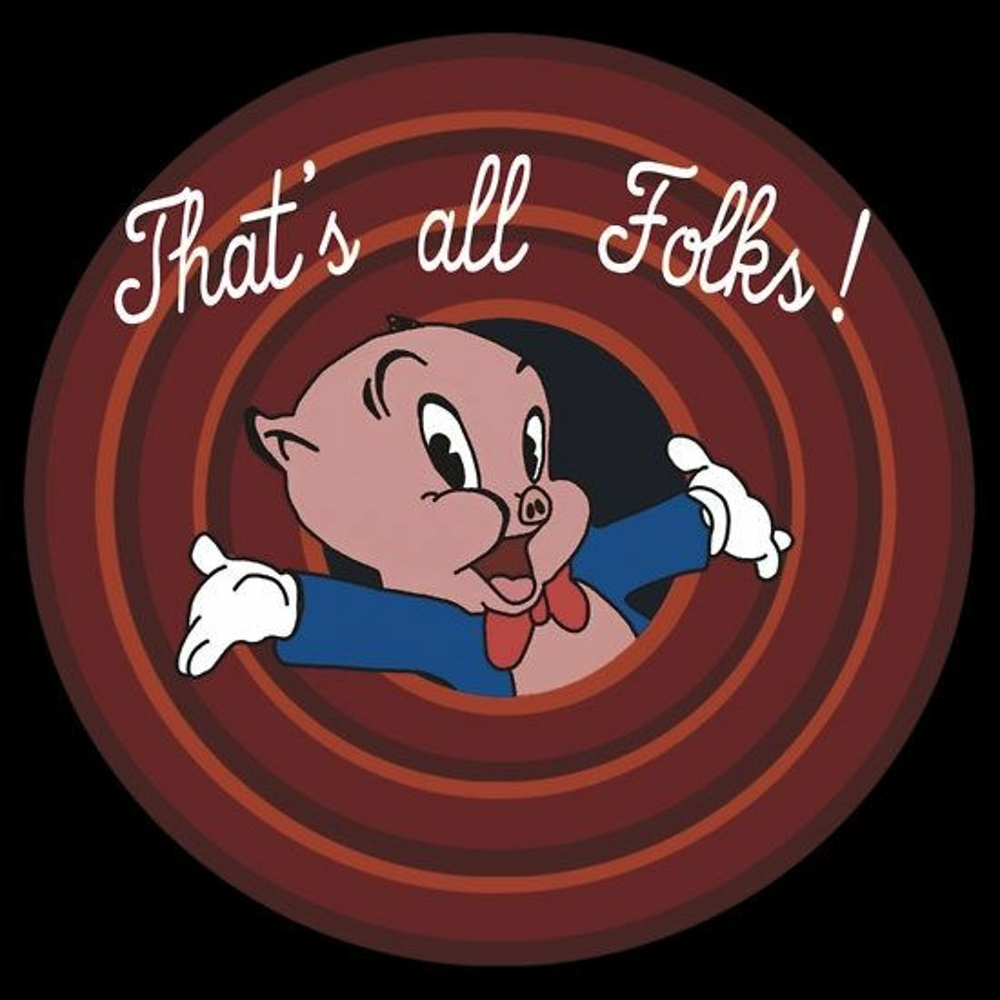

# That's all folks! 
July 23rd, 2025  

## Announcements

- Project due today to send for peer review. 

## Wrap-up  

## The golden rules of designed experiments 

- Randomization 
- Replication 
- Local control 

## Modeling data generated by designed experiments  

- The most common model that is the default in most software: $y_{ij} = \mu + T_i + \varepsilon_{ij} , \ \varepsilon_{ij}\sim N(0, \sigma^2)$. 
  - Independence 
  - Constant variance 
  - Normal distribution 
- Designed experiments sometimes handle EUs in groups, leaving us with groups of data that have something in common rather than being independent. 
- Different patterns of "similar groups" lead to us calling them different designs. 
  - Blocked designs - randomized complete block designs, incomplete block designs 
  - Multilevel designs: split-plot designs, multi-location designs, subsampling, etc.
  - Crossover designs 
  - Repeated measures (Time is one of the treatment factors) 
  - What is what? Sketch it! 
- Between-block recovery of information


### From ANOVA table to statistical model  

```{r echo=FALSE, message=FALSE, warning=FALSE}
t_design <- data.frame(Source = c("Day (block)", "", "Error(oven)", 
                                  "", "", "Error(oven x day)", "Total"),
                       df = c("r-1", "-", "(t-1)*d",
                              "-", "-", "(b-1)* t * d", "N-1"))

t_trt <- data.frame(Source = c(" ", "Temperature", "", 
                               "Recipe", "TxB", "Parallels", "Total"),
                    df = c("-", "t-1", "-",
                           "r-1", "(t-1)*(r-1)", "N-tb", "N-1"))

t_rcbd <- data.frame(Source = c("Day", "Temperature", "Error(oven)",
                                "Recipe", "TxB", "Error(oven x day)", "Total"),
                    df = c("d-1", "t-1", "(t-1)*d - (t-1)",
                           "r-1", "(t-1)*(r-1)", 
                           "(r-1)* t * d - (r-1) - (t-1)*(r-1)", "N-1"))

knitr::kables(
  list(
    knitr::kable(t_design, caption = "Design or Topographical Sources of Variability"),
    knitr::kable(t_trt, caption = "Treatment Sources of Variability"),
    knitr::kable(t_rcbd, caption = "Combined Table of the Sources of Variability")
  ),
  caption = 'Example ANOVA for the muffin experiment example'
)
```

The statistical model corresponding to this ANOVA table was 
$$y_{ijk} = \mu + \delta_k + T_i + w_{i(k)} + R_j + TR_{ij} + \varepsilon_{ijk},$$
where: 

- $y_{ijk}$ is the observation of the height of a muffin baked on day $k$ under the $i$th temperature, prepared with the $i$th recipe, 
- $\mu$ is the overall mean, 
- $\delta_k$ is the effect of day $k$,
- $T_i$ is the effect of the $i$th temperature, 
- $w_{i(k)}$ is the effect of over at the $i$th temperature on day $k$,  
- $R_j$ is the effect of the $j$th recipe, 
- $TR_{ij}$ is the interaction between the $i$th temperature and $j$th recipe, 
- $\varepsilon_{ijk}$ is the residual for the height of a muffin baked on day $k$ under the $i$th temperature, prepared with the $i$th recipe. 


### What happens if we drop blocks, split-plots, etc? 

**What if the elements of the design (blocks, whole plots) are not significant?** 

- Interpreting a small variance component (e.g., $\sigma^2_b$ ) vs. a non-significant fixed effect (i.e., $p_B >0.05$ ) 
- The Difference Between “Significant” and “Not Significant” is not Itself Statistically Significant - [Gelman and Stern (2012)](https://www.tandfonline.com/doi/abs/10.1198/000313006X152649) 
- Currently, the general advice is to include the randomization structure to avoid type I error inflation -- see "[Analyze as randomized -- Why dropping block effects in designed experiments is a bad idea (Frey et al., 2024)](https://acsess.onlinelibrary.wiley.com/doi/full/10.1002/agj2.21570)" 
- Review on split-plot designs, EU sizes, and subsampling/pseudoreplication. 

### Philosophical differences modeling multi-location designed experiments  

- Random versus fixed effects for modeling environments 
- 

**Example: sites were NOT randomly selected and are very different** 

An argument against "On the other hand, modeling location as a fixed effect restricts inference to those specific locations only. Therefore, if the goal is to make inferences across a broader region or range of conditions, treating location as a random effect is the preferred approach." 

```{r fig.height=4, fig.width=4}
df_env2 <- agridat::blackman.wheat %>% filter(loc %in% c("Cra", "Beg", "Edn"))
str(df_env2)

m_fixed <- lm(yield ~ nitro*type + loc, data = df_env2)
m_random <- lmer(yield ~ nitro*type + (1|loc), data = df_env2)
```

The marginal means look the same...  
```{r}
emmeans(m_fixed, ~ nitro:type)
emmeans(m_random, ~ nitro:type)
```

... but the CI is **sooooo** much wider for the mean of the mixed model! 

```{r}
as.data.frame(emmeans(m_fixed, ~ nitro:type)) %>% 
  mutate(CI_width = upper.CL-lower.CL)
as.data.frame(emmeans(m_random, ~ nitro:type)) %>% 
  mutate(CI_width = upper.CL-lower.CL)
```

Now let's take a look at the residual quantiles: 

```{r fig.height=4, fig.width=4}
simres1 <- DHARMa::simulateResiduals(m_fixed, plot = F)
DHARMa::plotQQunif(simres1, main = "QQ plot residuals - fixed model")

simres2 <- DHARMa::simulateResiduals(m_random, use.u = F)
DHARMa::plotQQunif(simres2, main = "QQ plot residuals - mixed model w/o RE")

simres3 <- DHARMa::simulateResiduals(m_random, use.u = T)
DHARMa::plotQQunif(simres3, main = "QQ plot residuals - mixed model")
```

What is happening?? 

**Shrinkage:** 

Take a look at $\hat{L}$ (fixed location effect): 
```{r}
as.data.frame(emmeans(m_fixed, ~loc))$emmean-mean(as.data.frame(emmeans(m_fixed, ~loc))$emmean)
```
And then take a look at $\hat{l}$ (random location effect): 
```{r}
as.vector(getME(m_random, "b"))
```


## Learn more about designing and analyzing experiments  

- Mixed models workshops in the Fall 
- Messy Data (STAT 870) in the Fall 
- Categorical Data Analysis (STAT 717) in the Spring
- Other resources: 
  - Stroup et al. 2024 
  - Andrew Gelman's (& friends) [blog](https://statmodeling.stat.columbia.edu/) 
  
  

```{r echo=FALSE, fig.cap="", out.width = '60%', fig.align='center'}

```
