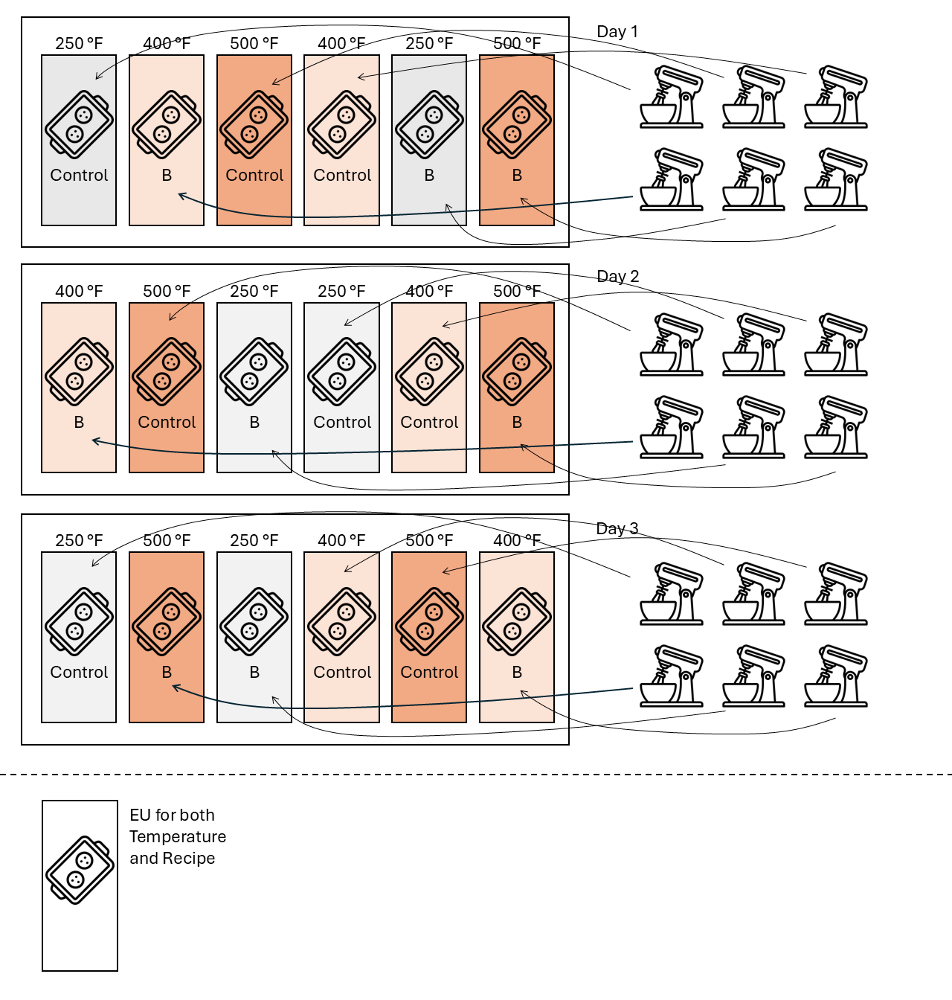

```{r setup, include=FALSE}
knitr::opts_chunk$set(echo = TRUE, fig.align='center')
```

# Background  

Banana muffins, much like banana bread, present a unique baking challenge due to the inclusion of mashed bananas in the batter. While this ingredient contributes moisture and flavor, it can also result in a dense crumb if not balanced properly with other recipe components and baking conditions. In particular, oven temperature and banana quantity play a critical role in achieving a light, fluffy texture. This study begins with a standard banana muffin recipe and explores how adjusting the baking temperature affects the final crumb structure, with the goal of identifying optimal conditions for producing well-risen, tender muffins.
**The objective of this study is to find the best combination of oven temperature and banana quantity to prepare banana muffins. The main priority, however, is to find differences between muffin recipe.** 

# Materials  

## Treatment structure

The proposed treatment structure is a $3 \times 2$ factorial treatment structure. 
The treatment factors will be oven temperature (250, 400, and 500 degrees Fahrenheit) and muffin recipe (control and extra banana). 
This treatment structure will allocate the same degrees of freedom for the treatment sources of variability, regardless of the design. 
Table 1 illustrates the degrees of freedom allocated to the sources of variability given by the treatment factors. 
Note that $N$ depends on the design structure and is thus not defined here.  

```{r echo=FALSE}
t_trt <- data.frame(Source = c("Temperature", "Banana Recipe", "Temp x Banana Recipe", "Parallels", "Total"),
                    df = c("t-1 = 3-1 = 2", "b-1 = 2-1 = 1", "(t-1)(b-1) = 2", "N-t", "N-1"))

knitr::kable(t_trt, caption = "Partial ANOVA table according to the 'What Would Fisher Do' technique - Treatment Sources of Variability. t indicates the number of temperature treatments, b indicates the number of banana recipe treatments, and N indicates the total number of observations.")
```


## Design structure 

The facility that is available to bake the muffins includes one oven that will homogeneously bake one tray of muffins. 
There are three different proposed approaches: a randomized complete block design, a split-plot design with temperature in the whole plot, and a split-plot design with recipe in the whole plot. 
For demonstration, I will consider designs with 3 repetitions. 
See the section "Power Analysis" for an analysis of the number of repetitions. 

### Randomized complete block design

A block design consists of groups of experimental units that are approximately similar among them. 
In a randomized complete block design, each treatment appears the same number of times within a block. 
In this case, I envision running a randomized complete block design by baking muffins on three different days. 
I assume that day is the blocking factor and then, bake all treatments (i.e., all combinations of temperature and recipe) once each day (Figure 1).

```{r echo=FALSE, fig.cap="Schematic representation of the RCBD.", out.width = '60%'}

```

Within a day, each treatment (i.e., C-250, C-400, C-500, B-250, B-400, B-500) is baked independently and one measurement is obtained from each treatment. 
The ANOVA table describing the treatment sources of variability is depicted in Table 2 and the final ANOVA table is depicted in Table 3. 
Both tables may also be rewritten as the statistical model 

$$y = \mu + T_i + R_j +TR_{ij} + b_k + \varepsilon_{ijk},$$
$$b_j \sim N(0, \sigma^2_b),$$
$$\varepsilon_{ijk}  \sim N(0, \sigma^2_\varepsilon),$$
where $y_{ijk}$ is the observed height for the muffin from temperature $i$, recipe $j$, and day $k$, 
$\mu$ is the overall mean, 
$T_i$ is the effect of the $i$th temperature, 
$R_j$ is the effect of the $j$th recipe, 
$(TR)_{ij}$ is the interaction between the $i$th temperature and the $j$th recipe, 
$b_k$ is the random effect from the $k$th day, 
and $\varepsilon_{ijk}$ is the residual for the muffin from temperature $i$, recipe $j$, and day $k$.


```{r echo=FALSE}
t_design <- data.frame(Source = c("Day (block)", "", "", "", "Error(oven)", "Total"),
                       df = c("r-1 = 3-1 = 2", " ", "", "", "(tb-1)r = (6-1)*3 = 15", "N-1 = 17"))

knitr::kable(t_design, caption = "Design or Topographical Sources of Variability for an RCBD")
```

 
```{r echo=FALSE}
t_rcbd <- data.frame(Source = c("Day", "Temperature", 
                                "Banana Recipe", "Temp x Banana Recipe",
                                "Error(oven)", "Total"),
                    df = c("r-1 = 3-1 = 2", "t-1 = 3-1 = 2", 
                           "b-1 = 2-1 = 1", "(t-1)(b-1) = 2",
                           "(tb-1)r - (t-1) -(b-2) - (t-1)(b-1) = 5*3 - 2 -1 -2 = 10",
                           "N-1 = 17"))

knitr::kable(t_rcbd, caption = "Combined Table of the Sources of Variability")
```


#### Mock R code for this design 

All mock R code in this report assumes the existence of a `data.frame` called `df` with the columns `oven_temp` as factor, `recipe` as factor, `rep` as factor, and `height_cm` as double. 

```{r eval=FALSE, include=TRUE}
library(lme4)
m <- lmer(height_cm ~ 1 + oven_temp * recipe + (1|rep), data = df)
```


### Split-plot design with temperature in the whole plot 

In this design, each oven temperature treatment (i.e., 250, 400, 500) is repeated 3 times within a day, and the recipe treatment is repeated 9 times (i.e., once for each oven). 
Within each oven, muffin batters for recipe C and B are prepared independently for each oven batch (Figure 2). 
One measurement is obtained from each temperature $\times$ recipe combination.
The ANOVA table describing the treatment sources of variability is depicted in Table 2 and the final ANOVA table is depicted in Table 3.

```{r echo=FALSE, fig.cap="Schematic representation of the split-plot design with temperature in the whole plot", out.width = '60%'}
knitr::include_graphics("../figures/muffin_splitplot1.PNG")
```

The ANOVA table describing the treatment sources of variability is depicted in Table 4 and the final ANOVA table is depicted in Table 5. 
Both tables may also be rewritten as the statistical model 

$$y = \mu + T_i + R_j +TR_{ij} + w_{i(k)} + \varepsilon_{ijk},$$
$$b_j \sim N(0, \sigma^2_b),$$
$$\varepsilon_{ijk}  \sim N(0, \sigma^2_\varepsilon),$$
where $y_{ijk}$ is the observed height for the muffin from temperature $i$, recipe $j$, and repetition $k$, 
$\mu$ is the overall mean, 
$T_i$ is the effect of the $i$th temperature, 
$R_j$ is the effect of the $j$th recipe, 
$(TR)_{ij}$ is the interaction between the $i$th temperature and the $j$th recipe, 
$w_{i(k)}$ is the whole plot random effect from the $i$th temperature and $k$th repetition, 
and $\varepsilon_{ijk}$ is the residual for the muffin from temperature $i$, recipe $j$, and repetition $k$.

```{r echo=FALSE}
t_design <- data.frame(Source = c("", "Error(oven)", "", "", "Error(oven x rep)", "Total"),
                       df = c(" ", "t*r-1 = 9-1 = 8", "", "", "(b-1)t*r = 9", "N-1 = 17"))

knitr::kable(t_design, caption = "Design or Topographical Sources of Variability for a split-plot design with temperature in the whole plot.")
```

 
```{r echo=FALSE}
t_splitplot <- data.frame(Source = c("Temperature", "Error(oven)",
                                     "Banana Recipe", "Temp x Banana Recipe", "Error(oven x rep)",
                                     "Total"),
                    df = c("t-1 = 3-1 = 2", "t*r-1 - (t-1) = 8 - 2 = 6",
                           "b-1 = 2-1 = 1", "(t-1)(b-1) = 2", "(b-1)tr - (b-1 + (t-1)(b-1))= 9 - 3 = 6", 
                           "N-1 = 17"))

knitr::kable(t_splitplot, caption = "Combined Table of the Sources of Variability")
```


#### Mock R code for this design 

```{r eval=FALSE, include=TRUE}
library(lme4)
m <- lmer(height_cm ~ 1 + oven_temp * recipe + (1|rep/oven_temp), data = df)
```

### Split-plot design with recipe in the whole-plot   

In this design, each oven temperature treatment (i.e., 250, 400, 500) is repeated 3 times within a day, and so is the recipe treatment. 
Three separate batters for recipe C and B are prepared independently and used to bake the muffins in a set of three oven temperatures (Figure 3). 
One measurement is obtained from each temperature $\times$ recipe combination.
The ANOVA table describing the treatment sources of variability is depicted in Table 2 and the final ANOVA table is depicted in Table 3.

```{r echo=FALSE, fig.cap="Schematic representation of the split-plot design with recipe in the whole plot", out.width = '60%'}

```

The ANOVA table describing the treatment sources of variability is depicted in Table 6 and the final ANOVA table is depicted in Table 7. 
Both tables may also be rewritten as the statistical model 

$$y = \mu + T_i + R_j +TR_{ij} + w_{j(k)} + \varepsilon_{ijk},$$
$$b_j \sim N(0, \sigma^2_b),$$
$$\varepsilon_{ijk}  \sim N(0, \sigma^2_\varepsilon),$$
where $y_{ijk}$ is the observed height for the muffin from temperature $i$, recipe $j$, and repetition $k$, 
$\mu$ is the overall mean, 
$T_i$ is the effect of the $i$th temperature, 
$R_j$ is the effect of the $j$th recipe, 
$(TR)_{ij}$ is the interaction between the $i$th temperature and the $j$th recipe, 
$w_{i(k)}$ is the whole plot random effect from the $j$th recipe and $k$th repetition, 
and $\varepsilon_{ijk}$ is the residual for the muffin from temperature $i$, recipe $j$, and repetition $k$.


```{r echo=FALSE}
t_design <- data.frame(Source = c("", "Error(batter)", "", "", "Error(batter x rep)", "Total"),
                       df = c(" ", "b*r-1 = 6-1 = 5", "", "", "(t-1)b*r = 2*6 = 12", "N-1 = 17"))

knitr::kable(t_design, caption = "Design or Topographical Sources of Variability for a split-plot design with batter in the whole plot.")
```

 
```{r echo=FALSE}
t_splitplot <- data.frame(Source = c("Temperature", "Error(batter)",
                                     "Banana Recipe", "Temp x Banana Recipe", "Error(batter x rep)",
                                     "Total"),
                    df = c("b-1 = 2-1 = 1", "b*r-1 - (b-1) = 5 - 1 = 4",
                           "t-1 = 3-1 = 2", "(b-1)(t-1) = 2",
                           "(t-1)b*r - (t-1 + (t-1)(b-1))= 12 - 4 = 8", 
                           "N-1 = 17"))

knitr::kable(t_splitplot, caption = "Combined Table of the Sources of Variability")
```

#### Mock R code for this design 

```{r eval=FALSE, include=TRUE}
library(lme4)
m <- lmer(height_cm ~ 1 + oven_temp * recipe + (1|rep/recipe), data = df)
```


## Expected results  

The effects of interest are $T_i$, $R_j$, and $TR_{ij}$. Overall, the first design (RCBD) will provide more precise estimates to detect differences between any T-R combination. 
Then, a split plot design with temperature in the whole plot (design 2) provides more simplicity to run the experiment, with a slight advantage to detect differences among levels of recipe treatment. 
Last, a split plot design with recipe in the whole plot (design 3) is perhaps the simplest in terms of time and effort required to run the experiment, with a slight advantage to detect differences among levels of temperature treatment. 

## Discussion of Designs  

Overall, the design that shows greater power for any treatment is the RCBD. 
However, this design is the most expensive (this design has the longest oven use hours), and most time-demanding (27 independent oven runs must be baked in this design). 
These downsides to this design do not seem to be compensated by only a slight improvement in power (see Section 3).

Both split-plot designs can be considered appropriate designs because (i) they are not excessively demanding in terms of time/resources. Either one would be a good option to answer the research question. 
However, the split-plot with temperature in the whole plot design will slightly favour detecting differences between recipes, which was the main priority for this experiment.

One potential downside of the split plot design is that the number of repetitions, so far, was selected arbitrarily. 
See section 3, "Power analysis", for a more detailed analysis of the number of repetitions and why 3 is actually an adequate number to detect differences of about 0.5 cm. 

Potential ways to improve the statistical power of the experiment to detect differences among recipes include (i) increasing the number of repetitions, (ii) increasing the number of temperature treatments, and (iii) including subsampling (i.e., multiple observational units within the experimental unit). 
All these strategies will improve the power via different mechanisms and will provide different benefits. 
First, increasing the number of repetitions will directly increase the number of degrees of freedom for the recipe contrasts (Table 8). 
```{r echo=FALSE}
t_splitplot <- data.frame(Source = c("Temperature", "Error(oven)",
                                     "Banana Recipe", "Temp x Banana Recipe", "Error(oven x rep)",
                                     "Total"),
                    `df with 3 reps` = c("t-1 = 3-1 = 2", "t*r-1 - (t-1) = 8 - 2 = 6",
                           "b-1 = 2-1 = 1", "(t-1)(b-1) = 2", "(b-1)tr - (b-1 + (t-1)(b-1))= 9 - 3 = 6", 
                           "N-1 = 17"), 
                    `df with 5 reps` = c("t-1 = 3-1 = 2", "t*r-1 - (t-1) = 14 - 2 = 12",
                           "b-1 = 2-1 = 1", "(t-1)(b-1) = 2", "(b-1)tr - (b-1 + (t-1)(b-1))= 15 - 3 = 12", 
                           "N-1 = 29"))

knitr::kable(t_splitplot, caption = "ANOVA Table comparing the split-plot design proposed in this manuscript and a slight improvement by increasing the number of repetitions.")
```
Then, increasing the number of temperature treatments will indirectly increase the number of degrees of freedom for the recipe contrasts, by increasing the number of whole plots (Table 9).
```{r echo=FALSE}
t_splitplot <- data.frame(Source = c("Temperature", "Error(oven)",
                                     "Banana Recipe", "Temp x Banana Recipe", "Error(oven x rep)",
                                     "Total"),
                    `df with 3 temperatures` = c("t-1 = 3-1 = 2", "t*r-1 - (t-1) = 8 - 2 = 6",
                           "b-1 = 2-1 = 1", "(t-1)(b-1) = 2", "(b-1)tr - (b-1 + (t-1)(b-1))= 9 - 3 = 6", 
                           "N-1 = 17"), 
                    `df with 5 reps` = c("t-1 = 5-1 = 4", "t*r-1 - (t-1) = 14 - 4 = 10",
                           "b-1 = 2-1 = 1", "(t-1)(b-1) = 4", "(b-1)tr - (b-1 + (t-1)(b-1))= 15 - 5 = 10", 
                           "N-1 = 29"))

knitr::kable(t_splitplot, caption = "ANOVA Table comparing the split-plot design proposed in this manuscript and a slight improvement by increasing the number of factor levels for temperature.")
```
Last, including subsampling will not affect the degrees of freedom for the recipe contrasts (note that the number of independent observations remains the same), but may reduce the residual variance.  


# Power analysis (optional)  

The previous example assumed 3 repetitions were enough. 
In this section, we show why this number provides adequate power to detect differences among recipe treatments of 0.5 cm height. 
Based on previous knowledge (i.e., our in-class experiment), we have knowledge of the potential variability in the data. 

In what follows, we will show a simulation study comparing the split-plot design with treatment in the whole plot that is describe above, with 2, 3, 4, and 5 repetitions. 

## Simulation study  


### Split-plot - 2 reps 

```{r warning=FALSE, message=FALSE}
sim_study_split_plot <- function(n_reps, n_sims){
  
  df_splitplot <-
    expand.grid(oven_temp = factor(c(250, 400, 500)),
                recipe = c("B", "C"),
                rep = 1:n_reps) %>% 
    mutate(wp_id = as.numeric(as.factor(paste(oven_temp, rep))))
  
  df_splitplot <- df_splitplot %>%
    mutate(mu = case_when(oven_temp == "250" & recipe == "B" ~ 2, 
                          oven_temp == "400" & recipe == "B" ~ 2.4, 
                          oven_temp == "500" & recipe == "B" ~ 2.6, 
                          oven_temp == "250" & recipe == "C" ~ 2.4, 
                          oven_temp == "400" & recipe == "C" ~ 2.8, 
                          oven_temp == "500" & recipe == "C" ~ 3))
  
  sigma_epsilon <- 0.26
  sigma_oven <- .12
  n <- nrow(df_splitplot)
  n_wp <- n_distinct(df_splitplot$oven_temp) * n_distinct(df_splitplot$rep)
  
  p_mu.1_mu.2 <- numeric(n_sims)
  p_mu1._mu2. <- numeric(n_sims)
  
  set.seed(42)
  
  for (i in 1:n_sims){
    oven_re <- rnorm(n_wp, 0, sigma_oven)
    df_temp <- df_splitplot %>% mutate(y = mu + oven_re[wp_id] + rnorm(n, 0, sigma_epsilon) )
    
    m <- lmer(y ~ oven_temp * recipe + (1|oven_temp:rep), data = df_temp)
    p_mu.1_mu.2[i] <- 
      as.data.frame(emmeans(m, ~recipe, contr = list(c(1, -1)))$contrasts)$p.value
    p_mu1._mu2.[i] <- 
      as.data.frame(emmeans(m, ~oven_temp, contr = list(c(1, -1, 0)))$contrasts)$p.value
  }
  p <- list(p_mu.1_mu.2 = p_mu.1_mu.2, p_mu1._mu2. = p_mu1._mu2.)
  return(p)
}
```


```{r message=FALSE, warning=FALSE, echo=TRUE, eval = FALSE}
sim_2reps <- sim_study_split_plot(n_reps = 2, n_sims = 100)
sim_3reps <- sim_study_split_plot(n_reps = 3, n_sims = 100)
sim_4reps <- sim_study_split_plot(n_reps = 4, n_sims = 100)
sim_5reps <- sim_study_split_plot(n_reps = 5, n_sims = 100)
```

```{r echo=FALSE, eval=TRUE, message=FALSE, warning=FALSE}
sim_2reps <- readr::read_rds("../../rds/sim2reps100.rds")
sim_3reps <- readr::read_rds("../../rds/sim3reps100.rds")
sim_4reps <- readr::read_rds("../../rds/sim4reps100.rds")
sim_5reps <- readr::read_rds("../../rds/sim5reps100.rds")
```


```{r echo=FALSE}
t_power <- data.frame(
  Design = c("Split plot design with 2 reps", "Split plot design with 3 reps", 
             "Split plot design with 4 reps", "Split plot design with 5 reps"),
  `Power split plot` = c(mean(sim_2reps$p_mu.1_mu.2<.05), mean(sim_3reps$p_mu.1_mu.2<.05), 
                         mean(sim_4reps$p_mu.1_mu.2<.05), mean(sim_5reps$p_mu.1_mu.2<.05)), 
  `Power whole plot` = c(mean(sim_2reps$p_mu1._mu2.<.05), mean(sim_3reps$p_mu1._mu2.<.05), 
                         mean(sim_4reps$p_mu1._mu2.<.05), mean(sim_5reps$p_mu1._mu2.<.05)))

knitr::kable(t_power, caption = "ANOVA Table comparing the split-plot design proposed in this manuscript and a slight improvement by increasing the number of factor levels for temperature.")
```


# Conclusion 

Considering the main priority of this experiment (i.e., detecting differences between recipe treatments) and 


# References  

When appropriate. 


