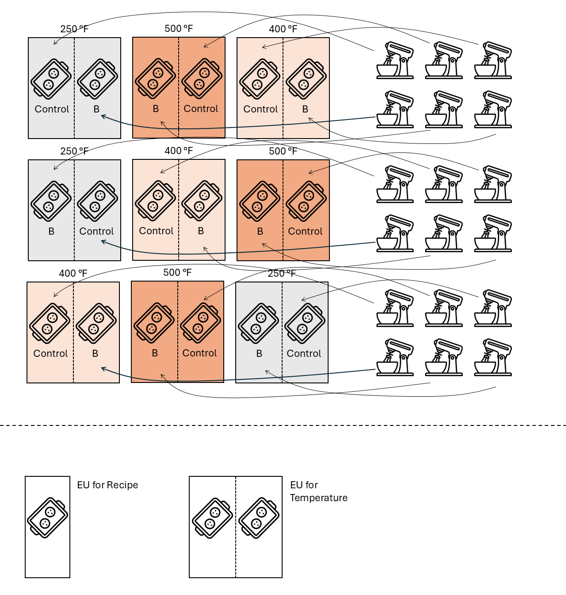

```{r setup, include=FALSE}
knitr::opts_chunk$set(echo = TRUE)
```

# Background  

Banana muffins, much like banana bread, present a unique baking challenge due to the inclusion of mashed bananas in the batter. While this ingredient contributes moisture and flavor, it can also result in a dense crumb if not balanced properly with other recipe components and baking conditions. In particular, oven temperature and banana quantity play a critical role in achieving a light, fluffy texture. This study begins with a standard banana muffin recipe and explores how adjusting the baking temperature affects the final crumb structure, with the goal of identifying optimal conditions for producing well-risen, tender muffins.
**The objective of this study is to find the best combination of oven temperature and banana quantity to prepare banana muffins. The main priority, however, is to find differences between muffin recipe.** 

# Materials  

## Treatment structure

The proposed treatment structure is a $3 \times 2$ factorial treatment structure. 
The treatment factors will be oven temperature (250, 400, and 500 degrees Fahrenheit) and muffin recipe (control and extra banana). 
This treatment structure will allocate the same degrees of freedom for the treatment sources of variability, regardless of the design. 
Table 1 illustrates the degrees of freedom allocated to the sources of variability given by the treatment factors. 
Note that $N$ depends on the design structure and is thus not defined here.  

```{r echo=FALSE}
t_trt <- data.frame(Source = c("Temperature", "Recipe", "Temp x Recipe", "Parallels", "Total"),
                    df = c("t-1 = 3-1 = 2", "r-1 = 2-1 = 1", "(t-1)(r-1) = 2", "N-t", "N-1"))

knitr::kable(t_trt, caption = "Partial ANOVA table according to the 'What Would Fisher Do' technique - Treatment Sources of Variability. t indicates the number of temperature treatments, r indicates the number of recipe treatments, and N indicates the total number of observations.")
```


## Design structure 

The facility that is available to bake the muffins includes one oven that will homogeneously bake one tray of muffins. 
There are three different proposed approaches: a randomized complete block design, a split-plot design with temperature in the whole plot, and a split-plot design with recipe in the whole plot. 
For demonstration, I will consider designs with 3 repetitions. 
See the section "Power Analysis" for an analysis of the number of repetitions. 

### Randomized complete block design

A block design consists of groups of experimental units that are approximately similar among them. 
In a randomized complete block design, each treatment appears the same number of times within a block. 
In this case, I envision running a randomized complete block design by baking muffins on three different days. 
I assume that day is the blocking factor and then, bake all treatments (i.e., all combinations of temperature and recipe) once each day (Figure 1).


```{r echo=FALSE, fig.cap="Figure 1. Schematic representation of the RCBD.", out.width = '60%'}
knitr::include_graphics("../figures/muffin_rcbd.PNG")
```

Within a day, each treatment (i.e., C-250, C-400, C-500, B-250, B-400, B-500) is baked independently and one measurement is obtained from each treatment. 
The ANOVA table describing the treatment sources of variability is depicted in Table 2 and the final ANOVA table is depicted in Table 3. 
Both tables may also be rewritten as the statistical model 

$$y = \mu + T_i + R_j +TR_{ij} + b_k + \varepsilon_{ijk},$$
$$b_j \sim N(0, \sigma^2_b),$$
$$\varepsilon_{ijk}  \sim N(0, \sigma^2_\varepsilon),$$
where $y_{ijk}$ is the observed height for the muffin from temperature $i$, recipe $j$, and day $k$, 
$\mu$ is the overall mean, 
$T_i$ is the effect of the $i$th temperature, 
$R_j$ is the effect of the $j$th recipe, 
$(TR)_{ij}$ is the interaction between the $i$th temperature and the $j$th recipe, 
$b_k$ is the random effect from the $k$th day, 
and $\varepsilon_{ijk}$ is the residual for the muffin from temperature $i$, recipe $j$, and day $k$.


```{r echo=FALSE}
t_design <- data.frame(Source = c("Day (block)", "", "Error(oven)", "Total"),
                       df = c("r-1 = 3-1 = 2", " ", "(t-1)r = (3-1)*3 = 6", "N-1 = 8"))

knitr::kable(t_design, caption = "Design or Topographical Sources of Variability for an RCBD")
```

 
```{r echo=FALSE}
t_rcbd <- data.frame(Source = c("Day", "Temperature", "Error(oven)", "Total"),
                    df = c("r-1 = 3-1 = 2", "t-1 = 3-1 = 2", "(t-1)r - (t-1) = 2*3 - 2 = 4", "N-1 = 8"))

knitr::kable(t_rcbd, caption = "Combined Table of the Sources of Variability")
```

### Split-plot design with temperature in the whole plot 

In this design, each oven temperature treatment (i.e., 250, 400, 500) is repeated 3 times within a day. 
Within each oven, muffin batters for recipe C and B are prepared independently for each oven batch (Figure 2). 
One measurement is obtained from each temperature$\times$recipe combination.
The ANOVA table describing the treatment sources of variability is depicted in Table 2 and the final ANOVA table is depicted in Table 3.

```{r echo=FALSE, fig.cap="Figure 2. Schematic representation of the split-plot design with temperature in the whole plot", out.width = '60%'}

```

The ANOVA table describing the treatment sources of variability is depicted in Table 4 and the final ANOVA table is depicted in Table 5. 
Both tables may also be rewritten as the statistical model 

$$y = \mu + T_i + R_j +TR_{ij} + w_{i(k)} + \varepsilon_{ijk},$$
$$b_j \sim N(0, \sigma^2_b),$$
$$\varepsilon_{ijk}  \sim N(0, \sigma^2_\varepsilon),$$
where $y_{ijk}$ is the observed height for the muffin from temperature $i$, recipe $j$, and repetition $k$, 
$\mu$ is the overall mean, 
$T_i$ is the effect of the $i$th temperature, 
$R_j$ is the effect of the $j$th recipe, 
$(TR)_{ij}$ is the interaction between the $i$th temperature and the $j$th recipe, 
$w_{i(k)}$ is the whole plot random effect from the $i$th temperature and $k$th repetition, 
and $\varepsilon_{ijk}$ is the residual for the muffin from temperature $i$, recipe $j$, and repetition $k$.

```{r echo=FALSE}
t_design <- data.frame(Source = c("", "Error(oven)", "", "", "Error(oven x day)", "Total"),
                       df = c(" ", "(t-1)d = (3-1)*3 = 6", "", "", "(r-1)t*d = 9", "N-1 = 17"))

knitr::kable(t_design, caption = "Design or Topographical Sources of Variability for an split-plot design")
```

 
```{r echo=FALSE}
t_splitplot <- data.frame(Source = c("Temperature", "Error(oven)",
                                     "Recipe", "Temp x Recipe", "Error(oven x day)",
                                     "Total"),
                    df = c("d-1 = 3-1 = 2", "t-1 = 3-1 = 2", "(t-1)d - (t-1) = 2*3 - 2 = 4",
                           "r-1 = 2-1 = 1", "(t-1)(r-1) = 2", "(r-1)tb - (r-1 + (t-1)(r-1))= 9 - 3 = 6", 
                           "N-1 = 17"))

knitr::kable(t_splitplot, caption = "Combined Table of the Sources of Variability")
```

### Split-plot design with recipe in the whole-plot   


```{r echo=FALSE, fig.cap="", out.width = '60%'}
knitr::include_graphics("../figures/muffin_splitplot2.PNG")
```


## Expected results  

The parameters of interest are  

## Discussion of Designs  

Overall, the design that shows greater power for any treatment is the RCBD. 
However, this design is the most expensive (this design has the longest oven use hours), and most time-demanding (27 independent oven runs must be baked in this design). 
These downsides to this design do not seem to be compensated by only a slight improvement in power ().

Both the split-plot and the strip-plot designs can be considered appropriate designs because (i) they are not excessively demanding in terms of time/resources. Either one would be a good option.  However, the split-plot design will slightly favour detecting differences between .  

One potential downside of this design is that the number of repetitions was selected arbitrarily. 
See the section "Power analysis" for a more detailed description. 

# Power analysis (optional)  

The previous example took 3 repetitions assumed . Based on our in-class experiment 

# References  

When appropriate. 


